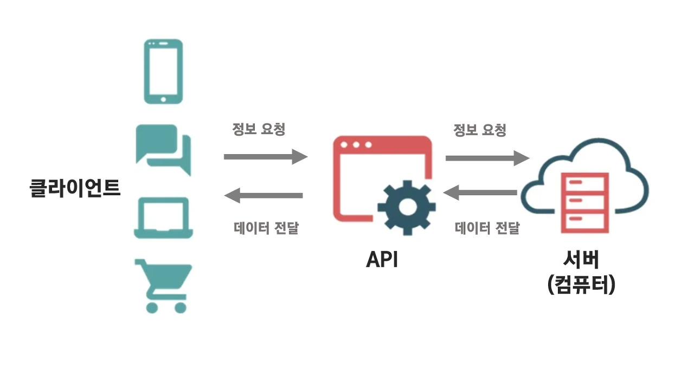

# API
## API란?
 - API(Application Programming Interface)란 두 소프트웨어가 서로 통신할 수 있도록 연결시켜주는 인터페이스이다.

</br>

## API를 사용한 소통


- API를 사용해 클라이언트가 원하는 정보를 요청하면 서버가 응답하는 과정으로 소통이 이루어진다.
- 크롬 브라우저에 접속해 주소(즉, url)를 통해 정보를 요청하면 타 서버에서 응답하는 것 역시 이러한 소통의 한 예로 볼 수 있다. 


</br>

## 코드 템플릿
- 이름으로 나이를 예측해주는 사이트인 agify.io에 정보를 요청해보자.


```
import requests

url = 'https://api.agify.io/?name=kylie'
print(requests.get(url).json())
```
</br>

- 가독성을 높여 보다 깔끔하게 표현하면 다음과 같다.
```
import requests

url = 'https://api.agify.io/?name=kylie'
response = requests.get(url).json()
print(response)
```
```
print(type(response)) # dict
print(response.get('name')) # kylie
print(response['name']) # kylie
```
</br>

- 동행복권 사이트에서 확인가능한 로또번호 정보를 api를 활용해 요청해보자.
 ```
import requests

url = 'https://www.dhlottery.co.kr/common.do?method=getLottoNumber&drwNo=1021'

response = requests.get(url).json()
print(response) # 12 15 17 24 29 45
```

</br>

- 로또번호를 하나씩 프린트해보자.

```
for i in range(1,7):
    print(response.get(f'drwtNo{i}')) # 문자열 포매팅
#
12
15
17
24
29
45
```