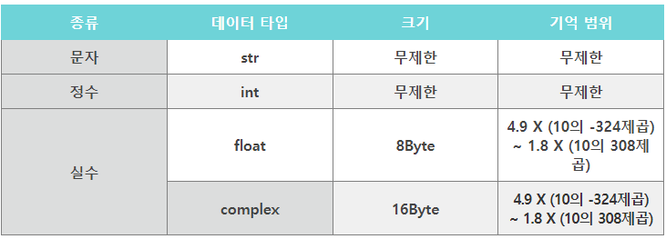
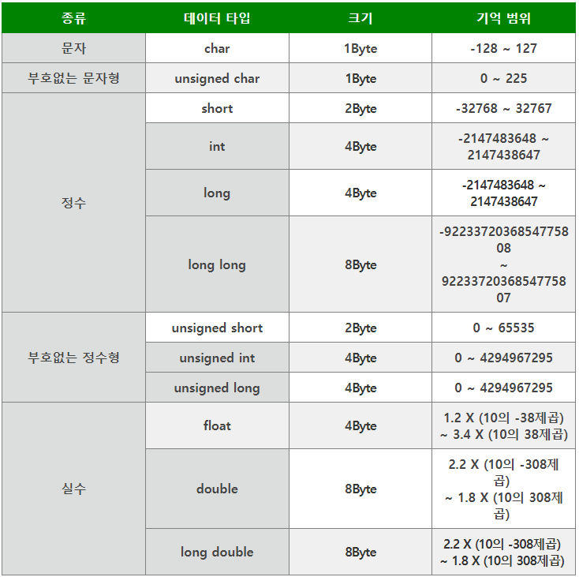
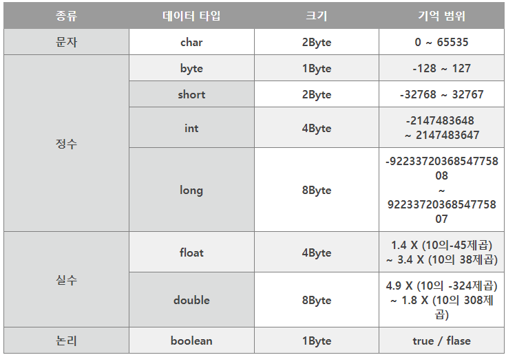
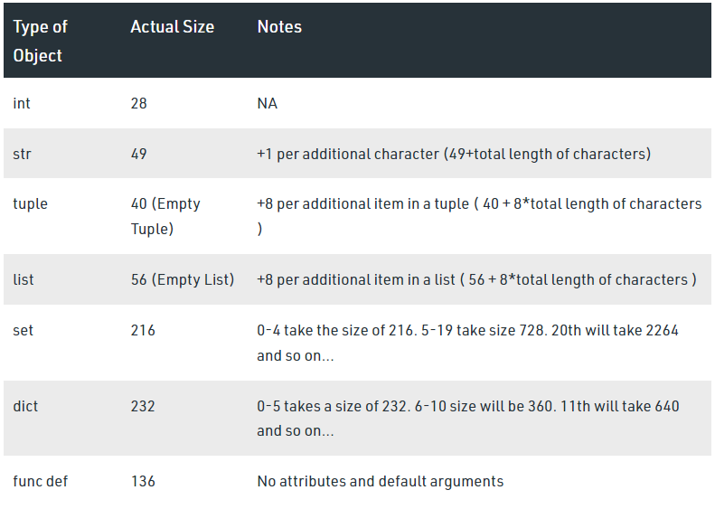

# 프로그래밍?

컴퓨터에게 명령하는 적절한 수행절차를 정의하고 이를 프로그램이 언어로 표현하는 과정

-  프로그래밍 과정
   - 컴퓨터에게 시키고 싶은 일을 정한다
   - 컴퓨터가 이해할 수 있도록 수행절차를 정의해서 표현한다
   - 적절한 프로그래밍 언어를 선택하고 언어를 이용해 절차를 기술한다
   - 발생하는 오류를 수정한다(**"디버깅”**) - 구문 오류(문법 틀려서 실행안됨), 논리 오류(문법 맞고 실행했는데 결과 안나옴)

</br>

  - 프로그래밍을 잘 하기 위해서는? 컴퓨팅 사고력이 좋아야 함
     - 컴퓨터의 특성을 잘 이해
     - 문제해결능력을 기름 - 논리적 사고 == 작은 문제로 쪼개기
     - 프로그래밍 언어에 능숙해진다 - trial & error
  
</br>

# 파이썬 개요

- Compiler vs Interpreter 
    - Compiler 언어 (예: C언어) - 문서를 모두 해석 후 명령(실행)
        - 번역(해석)에는 오래 걸리지만, 실행 자체는 굉장히 빠름
        - 실행 전에 오류 감지 가능 — 시스템 건드리는 건 컴파일러 언어 사용
    - Interpreter 언어 (예: python) - 한 줄 해석, 한 줄 명령(실행) 반복
        - 실행 후에 오류 감지 가능
        - 해석(컴파일) 과정 없이 바로 실행하기 때문에 수정, 디버깅에 유리 (개발 속도가 빠름) __ 개발자에게 유리한 언어

</br>

- 파이썬은 느린데 왜 발전했을까?
    - 4차 산업혁명에 특화됨 - 이제는 소프트웨어 요구사항이 전문적으로 변함(ex. 수학과, 생물학과, 지질학과 등의 분야에서 빠르게 결과를 보고 싶은 연구자)
    - 사람과 비슷한 언어로 개발되는 동시에 어느 정도 스펙이 된다는 점에서 python이 유리
    - 오픈소스 시장이 굉장히 발전해있음

</br>


# 파이썬 기초 문법

- 변수
  - = : 할당연산자
  - 변수의 이름을 식별자Identifiers라고 함(변수 , 함수, 클래스 …)
    - **식별자의 이름을 어떻게 지어야 하는가?**
    - “**읽기 쉽고 이해하기 쉬운”** 변수명이 최고임
    - 그래도 전 세계의 개발자들이 약속한 규칙이 있음 (PEP8)
    - 프로그래밍에서 변수는 메모리의 주소를 기억하는 이름이다. 우리는 변수를 이용해서 데이터를 기억한다.
        ```python
        >>> my_age = 25
        >>> id(my_age)
        1938341784624 #RAM에 저장된 주소값
        
        # 비교 연산자 '==' 를 사용해 객체의 id를 비교, 두 값이 정확히 같은 객체인지 검사할 수 있다.
        ```
        
    - 자료형마다 차지하는 메모리의 크기가 다르다

</br>

- 자료형
    - 수치형
        - 실수 연산시 주의할 점(부동 소수점)
            - 값을 비교하는 과정에서 정수가 아닌 실수면 주의! : 매우 작은 수보다 작은지 확인하거나 math 모듈 활용
    - 문자열
        - PEP8에서는 소스코드 내에서 하나의 문장부호를 선택하여 유지하도록 함(작은따옴표 or  큰따옴표)
        - 삼중따옴표: 작은따옴표나 큰따옴표를 삼중으로 사용(따옴표 안에 따옴표를 넣을 때, 혹은 여러 줄을 나눠 입력할 때 편리)
        - 제어 시퀀스(Escape sequence) : 문자 안에서 컴퓨터를 제어하고자 만들어짐.
            - \n(줄바꿈), \t(탭), \r(캐리지 리턴), \o(null), \\(\), \’(작은따옴표), \”(큰따옴표)
            - 캐리지 리턴? : 깜빡거리는 커서를 맨 앞으로 보냄
            
            ```python
            >>> print('aaaa\r bbb')
             bbb
            ```
            
        - String Interpolation: 문자열을 변수를 활용하여 만드는 법
            - f-strings(python 3.6+)
  
    - **자료형과 메모리(교안 89p, 중요!)**
        - 데이터를 컴퓨터가 기억하는 과정
            - 데이터를 저장할 공간을 메모리에 만들고
            - 저장할 공간에 대한 주소(id)를 할당받는다
            - 할당받은 주소를 기억했다가 —> 변수 지정시
            - 데이터를 해당 주소로 찾아가서 저장한다
            - 이후에 데이터가 필요해지면 해당 주소로 가서 읽어온다
        - 예시: a= 3이라고 하면 3이라는 값을 가지는 정수 자료형(객체)이 자동으로 메모리에 생성된다. a는 변수의 이름이며 3이라는 정수형 객체가 저장된 메모리 위치를 가리키게 된다. 즉, 변수 a는 객체가 지정된 메모리의 위치를 가리키는 레퍼런스(reference)라고도 할 수 있다.
        - 데이터마다 얼마나 메모리를 가지는지(먹는다, 할당받는다)?
          - 데이터 타입 크기 확인 방법
              
              ```python
              import sys
              x = 'Sample String'
              print(sys.getsizeof(x)) # 객체의 메모리 사이즈를 바이트 단위로 반환
              
              # 62
              ```
              
          - 언어별 데이터 타입 크기
              - 파이썬
              
                 
                  
              - C언어, C++
                  
                  
                  
              - Java
                  
                  
                
            - 파이썬이 메모리를 많이 먹는 이유? - 클래스를 사용하기 때문
            
            ```python
            en = 'a'
            ko = 'ㅁ'
            import sys
            print(sys.getsizeof(en)) # 50
            print(sys.getsizeof(ko)) # 76
            ```
            
            ```
            import sys
            print(sys.getsizeof(1)) # 28
            print(type(1)) # <class 'int'>
            ```
            
            
    
    -  None
       - 파이썬 자료형 중 하나 - 값이 없음을 표현, 일반적으로 반환값이 없는 함수에서 사용
       
       ```python
       isNone = None
       print(isNone)
       
       if isNone is None:
           print('조건문이 통과되었습니다. 함수가 버그났습니다.')
       ```
    -  불린형
       - 논리 자료형으로 참과 거짓을 표현하는 자료형, 비교/논리 연산에서 활용됨
       - 비교 연산자: 수학에서 등호와 부등호와 동일한 개념(<, ≤, >, ≥, ==, ≠)
           - 유의해야 하는 경우
           
           ```python
           print(3.0 ==3) # True 실수와 정수는 비교 가능
           print('3' != 3) # True 문자와 수치형은 상이
           print([1, 2, 3] == [1, 2, 3]) # True 리스트끼리도 비교 가능
           
           # 리스트 비교
           names = list(input())
           li = ['금기륜', '임병국']
           if names == li:
               print('같습니다')
           ```
           
       - 단, 객체 아이덴티티(OOP)의 경우 is. is not — 메모리 공간까지 동일한지 여부 판단
           - Class 개념과 관련
       - 논리 연산자: 여러 조건이 있을 때 모든 조건을 만족하거나(And), 여러 조건 중 하나만 만족해도 될 때(Or) 특정 코드를 실행하고 싶을 때 사용. 일반적으로 비교연산자와 함께 사용됨.
           - 조건을 순서대로 확인
               
               ```python
               hour = 23
               status = 'sleepy'
               print(hour >= 22 and status == 'sleepy') # True
               ```
               
           - **Falsy : False는 아니지만 False로 취급되는 다양한 값**
               - 0, 0.0, (), [], {}, None, **“”(빈 문자열)**
                   
                   ```python
                   print(not True) # False
                   print(not 0) # True
                   print(not 'hi') # False
                   ```
                   
               - 논리 연산자도 우선순위가 존재 - not, and, or 순으로 우선순위가 높음 (가독성 위해 괄호 사용 권장)
                   
                   ```python
                   print(((not True) and False) or (not False)) # True
                   if True or False or False or True:
                   	print('간단한 경우는 이렇게 표현해도 무방')
                   if (not False) or (True and False) or (not True):
                   	print('우선순위의 종류가 여러가지라면 괄호 적극 활용하세요!')
                   	# not -> and -> or 순으로 조건 확인
                   ```
                   
               - 단축 평가: 결과가 확실한 경우 두 번째 값은 확인하지 않고 첫 번째 값 반환
                   - **and 연산에서 첫번째 값이 False인 경우** 무조건 False: 첫번째 값 반환
                   - **or 연산에서 첫번째 값이 True인 경우** 무조건 True: 첫번째 값 반환
                   
                   ```python
                   if False and True and True and True:
                       # and 연산은 첫 번째 값이 False라면 볼 필요도 없이 False!
                       print('이 조건문은 무조건 False')
                   
                   if True or False or False or False:
                       # or 연산은 첫 번째 값이 True라면 볼 필요도 없이 True!
                       print('이 조건문은 무조건 True')
                   
                   print(5 and 3) # 3
                   print(0 and 3) # 0
                   print(3 or 0) # 3
                   print(0 or 3) # 3
                   # And는 앞이 True면 뒤쪽까지 봐야하고,
                   # Or는 앞이 True면 뒤쪽 안 봐도 됨
                   
                   # Exercise
                   print(3 and 5) # 5
                   print(3 and 0) # 0
                   print(0 and 3) # 0
                   print(0 and 0) # 0
                   
                   print(5 or 3) # 5
                   print(3 or 0) # 3
                   print(0 or 3) # 3
                   print(0 or 0) # 0
                   ```
                   
                   - 응용:
                   
                   ```python
                   (A, B 두 조건문의 실행 시간이 거의 비슷할 때)
                   A: True가 나올 확률 - 70% / False가 나올 확률 - 30%
                   B: True가 나올 확률 - 30% / False가 나올 확률 - 70%
                   
                   # and 연산 시 -> B가 앞에 나오는 것이 유리
                   if A and B 보다 if B and A
                   # or 연산 시 -> A가 앞에 나오는 것이 유리
                   if B or A보다 if A or B
                   ```

</br>
             

- 컨테이너
    - 여러 개의 값(데이터)을 담을 수 있는 객체로, 서로 다른 자료형을 저장할 수 있음
    - 컨테이너의 분류
        - 순서가 있는 데이터(Ordered) vs. 순서가 없는 데이터(Unordered)
            - 시퀀스형: 리스트, 튜플, 레인지
            - 비시퀀스형: 세트, 딕셔너리
        - 순서가 있다 ≠ 정렬되어 있다.
    - 시퀀스형
        - 리스트 - 어떠한 자료형도 저장가능, 리스트 안에 리스트도 넣을 수 있음
            
            ```python
            location = ['서울', '대전', '구미', '광주', '부울경']
            
            for one in location:
                print(one, end= ' ') # 개별 원소들로 접근
            
            for i in range(5):
                print(locaion[i], end= ' ') # 인덱스로 접근
            
            location[0] = '제주'
            print(location) # ['제주', '대전', '구미', '광주', '부울경']
            
            # 가변 자료형
            ```
            
        - 튜플 - 리스트와의 차이점은 생성 후, 담고 있는 값 변경이 불가.
            
            ```python
            # 불변자료형
            location = ('서울', '대전', '구미', '광주', '부울경')
            print(location)
            location[0] = '제주'
            # TypeError: 'tuple' object does not support item assignment  
            
            a = (3)
            print(a) #3
            print(type(a)) # <class 'int'> -- 괄호는 먼저 계산하라는 의미로 해석됨
            
            b = (3,)
            c = (1, 2, 3,) # Trailing comma -- 없어도 되지만, 넣는 것을 권장(다른 개발자가 쓰기 편하게 해줌)
            print(type(b)) # <class 'tuple'>
            print(type(c)) # <class 'tuple'>
            ```
            
        - 레인지(Range)
            
            ```python
            N = 5.0
            print(range(N))
            # TypeError : 'float' object cannot be interpreted as an integer
            
            N = 5
            print(range(N)) # range(0, 5)
            print(list(range(N))) # 활용 예시 # [0, 1, 2, 3, 4]
            print(type(range(N))) # <class 'range'>
            
            print(list(range(0, 11, 2))) 
            # 2 step 간격으로 출력
            # [0, 2, 4, 6, 8, 10]
            
            # 단순 출력을 5번 반복하는 경우
            for i in range(5):
                print('서울 2반 화이팅')
            # i가 활용되지 않으므로 i 메모리가 낭비됨
            # 단순 반복이라는 개발자들 간 표시로서 i 대신 _(underbar) 사용
            # i 쓴다는 것은 for문 안에서 언젠가 활용됨을 의미!
            ```
            
        - 슬라이싱 연산자
            - 시퀀스를 특정 단위로 슬라이싱
                
                ```python
                s = 'abcdefghi'
                print(s[8]) # i
                print(s[2:5]) #cde
                
                #cde만 빼고 출력 (index: 2, 3, 4)
                print(s[0:2] + s[5:9]) # abfghi
                # 모든 시퀀스 자료형에서 시작과 끝 인덱스 번호는 생략 가능
                print(s[:2] + s[5:]) # abfghi
                
                #### 슬라이싱
                - Sequence[start:end[:step]]
                # 문자열, 튜플, 레인지에서 모두 동일하게 동작합니다.
                print([1, 2, 3, 4][0:4:2]) # [1, 3]
                s = 'abcdefghi'
                print(s[::]) # abcdefghi
                print(s[::-1]) # ihgfedcba
                ```
                
    - 비시퀀스형
        - 딕셔너리
        
        ```python
        di = {}
        
        # 딕셔너리에 key, value 추가
        di['name'] = '이연주'
        
        # 전체 조회
        print(di) # {'name': '이연주'}
        
        # 특정 key 조회
        print(di['name']) # 이연주
        print(di.get('name')) # 이연주
        
        # get함수와의 차이
        # di['nothing']은 KeyError 발생 -> 에러가 나며 프로그램이 중지됨
        # di.get('nothing') = None 반환 -> 아래 코드를 계속 실행
        
        print(di['nothing']) # KeyError : 'nothing' 
        print('여기까지 오나요?')
        
        print(di.get('nothing')) # None
        print('여기까지 오나요?')
        ```
        
        - 리스트와 비교
          
        ```python
          # list vs dictionary
          # 데이터 순서(이름, 나이)가 보장된다면 list로도 dictionary를 대체할 수 있음
          li = [
              ['이름1', 23],
              ['이름2', 24],
              ['이름3', 26]
              ]
          # list가 편하긴 한데 dictionary가 list보다 검색속도가 빠르기 때문에 데이터의 양이 많다면 dict 사용
          
          di = {
              'names' : ['이름1', '이름2', '이름3'],
              'ages' : [23, 24, 26]
              # 'people': {
              #     ['이름1', 23]
              # }
          }
          
          # Key 리스트 반환
          print(di.keys())
          
          # value 리스트 반환
          print(di.values())
          # 예시
          for value in di.values():
              print(value)
          
          # (key, value) 쌍 얻기
          print(di.items())
          print('없는키값' in di) # True or False로 반환
        ```
        - set
        ```python
        # set 자료형(집합 자료형)
        # 중복을 제거할 때 사용
        # 순서가 없고, 집합 안에서 모든 값이 unique 하다.
        li = [3, 2, 1, 1, 2, 3, 1, 2, 3, 4, 5, 2, 4, 5]
        s = set(li)
        print(s) # {1, 2, 3, 4, 5}
        
        li = ['e', 'f', 'd', 's', 'f', 'd']
        s = set(li)
        print(s) # 출력할 때마다 순서 바뀜
        
        # 하나하나 출력하고 싶다 or index 접근을 하고 싶으면 list로 형변환
        print(list(s))
        
        s1 = set([1, 2, 3, 4, 5, 6])
        s2 = set([4, 5, 6, 7, 8, 9])
        
        # 교집합
        s1 & s2
        s1.intersection(s2)
        
        # 합집합
        s1 | s2
        s1.union(s2)
        
        # 차집합
        s1 - s2
        s1.difference(s2)
        ```

</br>
       

- 형변환
    - 데이터 형태는 서로 변환할 수 있음
    - 암시적 형 변환: 사용자가 의도하지 않고, 파이썬 내부적으로 자료형 변환
        
        ```
        # 크기가 다른 메모리 간 계산 -- 작은 것을 큰 것에 자동으로 맞춰서 계산
        # int to float
        print(3.3 + 4)
        # boolean to int
        print(True + 3) # 4
        # 예외
        print('3' + 3)
        # TypeError : can only concatenate str (not "int") to str
        ```
        
    - 명시적 형 변환: 사용자가 특정 함수를 활용하여 의도적으로 자료형 변환
        
        ```python
        print(int('3') + 3) # 6
        print(float('3.5') + 3) # 6.5
        
        # 많이 사용되는 형변환
        # 1. float to int
        print(int(3.7)) # '버림'임에 유의
        
        # 2. string to 숫자 형변환은 반드시 타입이 맞는 문자열 숫자만 가능하다.
        print(int('4.0'))
        # ValueError : invalid literal for int() with base 10: '4.2'
        print(float('3'))
        
        # 3. string으로 변환
        # 다 가능하지만, 컨테이너들은 구분자(괄호)들도 함께 들어간다.
        print(str([1, 2, 3]))
        # [참고] *을 붙여서 시퀀스 컨테이너를 넣으면 공백으로 구분되어 출력됨.
        li = [1, 2, 3, 4, 5]
        print(*li)
        ```
        
    - range, dictionary 로는 형변환 바로 불가능
