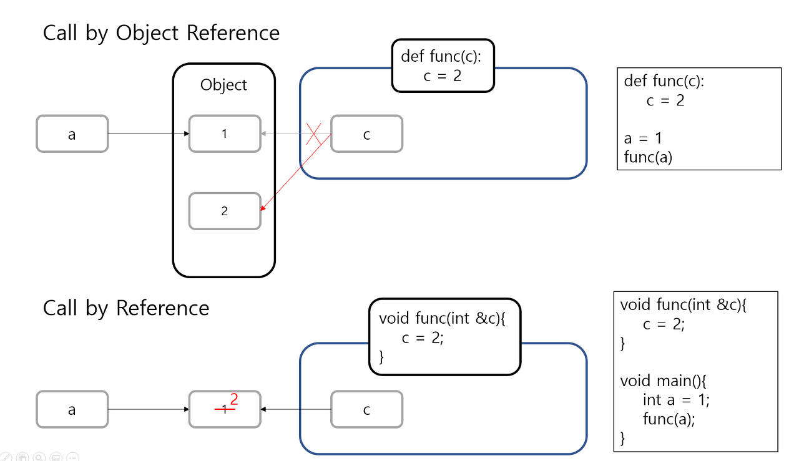
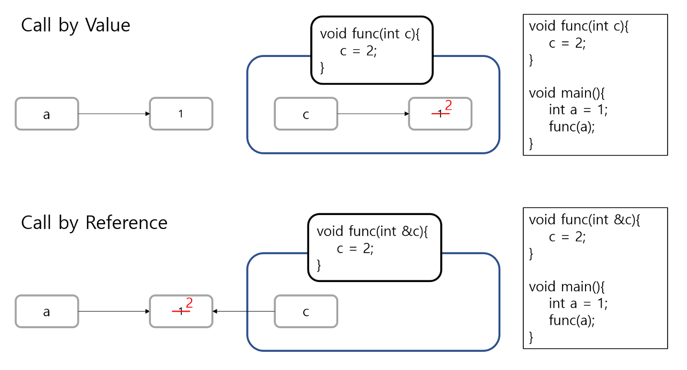

# 함수(Fuction)

- 함수란?
    - 특정한 기능을 하는 코드의 조각(묶음)
    - 특정 코드를 매번 다시 작성하지 않고, 필요시에만 호출하여 간편히 사용
    - `함수명()`으로 호출
- 함수를 왜 사용하는가?
    - 분해(Decomposition) : 간결하고 이해하기 쉽게 하기 위함
    - 추상화(Abstraction) : 복잡한 내용을 모르더라도 사용할 수 있음. 재사용성과 가독성, 생산성을 위함.
- 함수의 종류
    - 내장함수 : 파이썬에 기본적으로 포함된 함수
    - 외장함수 : Import문을 통해 사용하며, 외부 라이브러리에서 제공하는 함수
    - 사용자 정의 함수 : 직접 사용자가 만드는 함수

</br>

## 함수 기본 구조

- 선언과 호출(define&call)
    - 기본 형태
        
        ```python
        # 키워드 식별자(파라미터):
        def pstdev(data,mu=None):
        	# Function body
        	var = pvariance(data,mu)
        	try:
        		return var.sqrt()
        	except AttributeError:
        		return math.sqrt(var)
        ```
        
- 입력(Input)
    - Parameter: 함수를 정의할 때, 함수 내부에서 사용되는 변수
    - Argument: 함수를 호출할 때, parameter를 통해 전달되는 값
        
        ```python
        def function(ham): # parameter: ham
        	return ham
        
        fuction('spam') # argument: 'spam'
        ```
        
        - Positional Arguments : 기본적으로 함수 호출 시 Argument는 위치에 따라 함수 내에 전달됨
        - Keyword Arguments : 직접 변수의 이름으로 특정 Argument를 전달할 수 있음. 그러나 Keyword Argument 다음에 Positional Argument를 활용할 수 없음
            
            ```python
            def add(x, y):
            	return x + y
            
            # Positional Argument
            add(2, 5)
            
            # keyword arguments
            add(y=5, x=2)
            add(x=2, y=5)
            add(2, y=5)
            add(x=2, 5) # -> Error!
            ```
            
        - Default Arguments Values : 기본값을 지정하여 함수 호출 시 argument 값을 설정하지 않도록 함. 따라서 정의된 것보다 더 적은 개수의 argument들로 호출될 수 있음
            
            ```python
            def add(x, y=0):
            	return x + y
            
            add(2) # 2
            ```
            
- 문서화(Docstring)
- 범위(Scope)
    - Namespace: 무언가를 할당했을 때 컴퓨터가 저장해두는 공간. 즉, 식별자들을 기억하는 공간
        - 종류
            - Built-in namespace: return, id, dict, list, …
            - Global namespace: .py가 실행되면서 생성되는 namespace(스크립트 단위)
            - Enclosing namespace: 중첩 def문(def문 안의 def문)의 경우 내부 함수를 감싸고 있는 바깥 함수의 namespace
            - Local namespace: def로 생성한 함수를 실행할 때 함수 내부에 생성되는 namespace
                
                ```python
                def func1():
                    print('func1 시작')
                
                    def func2():
                        print('func2 시작')
                        print('func2 끝')
                        return
                
                    func2()
                    return
                
                func1()
                '''
                func1 시작
                func2 시작
                func2 끝
                '''
                ```
                
        - 같은 이름이 존재할 경우?
            - 변수의 제한범위(Scope) : **“L → E → G → B” 순(LEGB rule).** 즉 가장 작은 범위부터 찾는다.
                
                ```python
                x = 'global'
                
                def func1():
                    y = 'enclosing'
                    def func2():
                        z = 'local'
                        print(x, y, z)
                    
                    func2()
                
                func1()
                # 변수 x가 func2의 local namespace에 없음
                # enclosing namespace에도 없음
                # global namespace에 있음
                # 'global' 출력
                ```
                
    - 함수는 코드 내부에 local scope를 생성하며, 그 외의 공간인 global scope로 구분
        - global scope: 코드 어디에서든 참조할 수 있는 공간
        - local scope: 함수가 만든 scope. 함수 내부에서만 참조 가능
    - Variable 역시 global variable(global scope에 정의된 변수)과 local variable(local scope에 정의된 변수)로 구분
        
        ```python
        x = 'global'
        
        def func1():
            x = 'enclosing'
        
            def func2(a, b):
                x = 'local'
                print(x)
                print(locals()) 
                # print(globals())   
        
            func2(2, 3)
        
        func1()
        
        '''
        local
        {'a': 2, 'b': 3, 'x': 'local'}
        '''
        ```
        
        ```python
        x = 'global'
        
        def func1():
            global x # 변수 x를 global 에서 찾아!
            x = 'enclosing'
            print(x)
        
        func1()
        print(x)
        
        '''
        enclosing
        enclosing
        '''
        ```
        
    - 주의사항
        - 기본적으로 함수에서 선언된 변수는 Local scope에 생성되며, 함수 종료 시 사라짐
        - 해당 scope에 변수가 없는 경우 LEGB rule에 의해 이름을 검색함
            - 변수에 접근은 가능하지만, 해당 변수를 수정할 수는 없음
            - 값을 할당하는 경우 해당 scope의 이름공간에 새롭게 생성되기 때문
            - 단, 함수 내에서 필요한 상위 scope 변수는 argument로 넘겨서 활용할 것(알고리즘할 때는 global x 사용하는 게 유용할 수 있는데, 막 쓰진 말자.)
        - 상위 scope에 있는 변수를 수정하고 싶다면 global, nonlocal 키워드 활용 가능
            - 단, 코드가 복잡해지면서 변수의 변경을 추적하기 어렵고 예기치 못한 오류가 발생할 수 있음.
            - 따라서 가급적 사용하지 않는 것을 권장하며, 함수로 값을 바꾸고자 한다면 항상 argument로 넘기고 리턴 값을 사용하는 것을 추천
        - 관련 코드 예시
        
            ```python
            my_list = [1, 2, 3, 4]
            
            def func1():
                my_list = [5, 6, 7]
            
            func1()
            print(my_list)
            
            '''
            [1, 2, 3, 4]
            '''
            
            # 전역 변수를 함수에서 인자로 받아오더라도 함수 내에서는 지역변수(이름표)에 불과
            # 함수 내에서 이름표를 떼서 다른 객체에 붙인다고 하더라도, 그 이름표는 함수 내에서만 사용하는 이름표일 뿐이다.
            # 결국 함수 호출이 끝나면 전역 변수(이름표)가 여전히 그 객체에 붙어있다.
            ```
            
            ```python
            my_list = [1, 2, 3, 4]
            
            def func1():
                my_list[1] = 5554
            
            func1()
            print(my_list)
            
            '''
            [1, 5554, 3, 4]
            '''
            # 주의할 점은 이름표(변수)만 떼고 붙이는 것이 아니라, 이름표가 붙여진 물건(객체)의 구성품을 직접 조작하는 경우임.
            # 위처럼 객체 내의 요소(element)를 조작할 수 있으며, 이 경우에 함수의 호출이 끝나서 지역 이름표가 전역 이름표로 바뀐다고 하더라도
            # 객체가 변한 상태이므로 my_list은 [1, 5554, 3, 4]가 된다.
            
            # 이때, 객체 자체를 바꾸려면 당연히 객체가 mutable, 즉 가변적인 포맷이어야 한다.
            ```
            
            ```python
            x = 1
            
            def func1():
                x = 2
            
                def func2():
                    x = 3
                    print(x)
                
                func2()
                print(x)
            
            func1()
            print(x)
            
            '''
            3
            2
            1
            '''
            ```
            
            ```python
            x = 1
            
            def func1():
                x = 2
            
                def func2():
                    global x
                    x = 3 # global에 있는 x 가 3으로 바뀜
                    print(x)
                
                func2()
                print(x)
            
            func1()
            print(x)
            
            '''
            3
            2
            3
            '''
            ```
            
            ```python
            x = 1
            
            def func1():
                x = 2
            
                def func2():
                    nonlocal x
                    x = 3 # enclosing에 있는 x 가 3으로 바뀜
                    # 나를 감싸고 있는 가장 가까운 함수의 변수값을 바꿈
                    print(x)
                
                func2()
                print(x)
            
            func1()
            print(x)
            
            '''
            3
            3
            1
            '''
            ```
            
            ```python
            def func1():
                x = 10
            
                def func2():
                    nonlocal x
                    x = 20 # enclosing에 있는 x를 10->20으로 바꿈
                
                func2()
                print(x) # enclosing variable x인 20을 출력
            
            func1()
            print(x) # global에는 x가 없음
            
            '''
            20
            NameError: name 'x' is not defined
            '''
            ```
        
    - 변수의 수명주기(lifecycle)
        - Built-in scope: 파이썬이 실행된 이후부터 영원히 유지
        - Global scope: .py이 호출된 시점 혹은 인터프리터가 끝날 때까지 유지
        - Local scope: 함수가 호출될 때 생성되고, 함수가 종료될 때까지 유지
- 결과값(Output)
    - Void function: 명시적인 return값이 없는 경우, None을 반환하고 종료
    - Value returning function
        - 함수 실행 후 , return문을 통해 값 반환
        - return을 하게 되면 값 반환 후 함수가 바로 종료
    - print 함수와 return의 차이점
        - print를 사용하면 호출될 때마다 값이 출력됨(주로 테스트를 위해 사용)
        - 데이터 처리를 위해서는 return 사용
        - [참고] 둘다 선택적으로 사용하는 것임
    - 튜플을 활용하여 두 개 이상의 값 반환
        
        ```python
        def minus_and_product(x, y):
        	return x - y, x * y
        
        y = minus_and_product(4, 5)
        print(y) # (-1, 20)
        print(type(y)) # <class 'tuple'>
        ```
        

</br>


## [참고] 함수의 인자전달방식

- Call by Reference vs Call by Value
    
    
    
    - Call by Value
        - 변수를 복사한 값을 전달하는 방식
        - 따라서 함수 내에서 해당 인자를 조작하여 바꾸었다고 해도 원본 변수 a는 변하지 않음
        - 불변 타입의 객체를 넘기는 경우
    - Call by Reference
        - 인자로 받은 변수의 주소 값을 전달하는 방식
        - 따라서 함수 내에서 해당 인자를 조작하면 원본 변수의 주소 값으로 타고 들어가 해당 값 자체를 바꿔버림. 이를 통해 전역 변수의 즉각적 변경이 가능하지만, 부주의하면 변수를 잘못 조작해 프로그램에 문제를 야기할 수 있음.
        - 가변 타입의 객체를 넘기는 경우
- 그렇다면 파이썬은?  **“Call by assignment(Call by Object Reference)”**
    
    
    
    - immutable 한 포맷의 객체(tuple 등)는 변경할 수 없지만,
    - mutable한 포맷의 객체(list, dictionary, 직접 만든 클래스 등)는 변경할 수 있다
    - 코드 예시
        
        ```python
        li = [1, 2, 3]
        li2 = li # li의 주소값이 li2로 들어감
        li2[0] = 10
        
        print(li) # [10, 2, 3]
        print(id(li2), id(li)) # 2811201764224 2811201764224
        ```
        
- 참고 페이지 : 
[Python - Call by Object Reference](https://foramonth.tistory.com/20)

</br>

## [추가 실습] 함수 기초

- 중복적 기능을 찾아 코드 길이 줄이기
    
    ```python
    foods = ['찜닭', '김치', '콩자반', '계란후라이']
    
    for food in foods:
        eat_food(food)
        have_a_drink('물')
        eat_dessert()
        have_a_drink('콜라')
    ```
    
- 재사용성 높은 함수를 활용해 코드 길이 줄이기
    
    ```python
    def eat(pre_action, anything, after_action):
        """
        무언가를 먹는 기능
        pre_action: 입에 넣기 위한 사전동작
        anything: 무언가
        after_action: 무언가를 삼키기 위한 동작
        """
        print(pre_action)
        print(f"{anything}을/를 입에 넣는다")
        print(after_action)
    
    for food in foods:
        eat('수저를 집는다', food, '냠냠')
        eat('뚜껑을 딴다', '물', '꿀꺽')
        eat('손집게를 만든다', '과자', '냠냠')
        eat('뚜껑을 딴다', '콜라', '꿀꺽')
    ```
    

- Namespace
    - 이름(Name)에 따라 구분할 수 있는 범위를 의미
        - 파이썬의 모든 것은 객체(class)인데, 이들 각각은 모두 이름을 갖는다.
        - 해당 이름을 기억하는 공간을 Namespace라 부름
    - 종류
        - Local
        - Enclosed
        - Global : 하나의 file
        - Built-in : 이미 알고 있음
    - 예시
        
        ```python
        x = 0
        
        def func1():
            x = 10
        
            def func2():
                x = 20
                print(x)
            func2()
            print(x)
        
        print(x)
        func1()
        
        '''
        0
        20
        10
        '''
        ```
        
    - 주의: 수정할 때는 반드시 global 또는 nonlocal을 해줘야 함
        - global keyword : global 영역에 있는 변수를 가져와 씀
        - nonlocal keyword : 내 영역과 가장 가까운 영역의 변수를 가져와 씀(global 영역에서는 못가져옴)
        
            ```python
            count = 0
            
            def func():
                global count
                print('함수 호출됨')
                count += 1
            
            for _ in range(5):
                func()
            
            print(count)
            
            '''
            함수 호출됨
            함수 호출됨
            함수 호출됨
            함수 호출됨
            함수 호출됨
            5
            '''
            ```
            
            ```python
            def func1():
                x = 10
            
                def func2():
                    x = 20
            
                    def func3():
                        nonlocal x
                        x += 10
                        print(x) # 30
                    
                    func3()
                    print(x) # 30
                
                func2()
                print(x) # 10
            
            func1() # 주의 global에는 x가 없다!
            
            '''
            30
            30
            10
            '''
            ```
        
    - 전역변수의 사용은 최소한으로!
    - 아스키 코드
        
        ```python
        # 소문자 출력
        a = 'a'
        for i in range(26):
            print(chr(ord('a') + i), end=' ')
        # a b c d e f g h i j k l m n o p q r s t u v w x y z
        
        # 대문자 출력
        a = 'A'
        for i in range(26):
            print(chr(ord('A') + i), end=' ')
        # A B C D E F G H I J K L M N O P Q R S T U V W X Y Z
        
        # 대소문자 판별
        print(ord('a'), ord('z'), ord('A'), ord('Z')) # 97 122 65 90
        
        if 97 <= ord(w) <= 122:
        		print('소문자 알파벳이다')
        
        # ord: 문자 -> 숫자
        # chr: 숫자 -> 문자
        ```