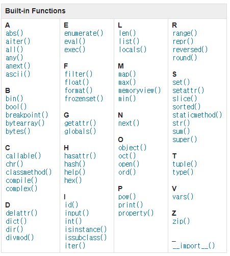

# 함수 응용

## 내장 함수(Built-in Functions)

- Python built-in functions — 암기 ㄴㄴ
    
    
    
- map
    - map(function, iterable)
        
        ```python
        def my_magic_func(n):
            return n * 10
        my_list = [1, 2, 3, 4, 5]
        # 순환 가능한 데이터구조의 모든 요소에 함수에 적용한 결과를 map object로 변환
        print(list(map(my_magic_func, my_list))) # [10, 20, 30, 40, 50]
        ```
        
- filter
    - filter(function, iterable)
        
        ```python
        def odd(n):
            return n % 2
        numbers = [1, 2, 3]
        result = filter(odd, numbers) 
        # 함수에 적용한 결과가 True인 것들을 filter object로 변환
        print(result, type(result)) # <filter object at 0x0000022300CC8490> <class 'filter'>
        print(list(result)) # [1, 3]
        ```
        
- zip
    - zip(*iterables)
        
        ```python
        girls = ['jane', 'ashley']
        boys = ['justin', 'eric']
        pair = zip(girls, boys)
        print(pair, type(pair)) # <zip object at 0x000001FBD6A98740> <class 'zip'>
        print(list(pair)) # [('jane', 'justin'), ('ashley', 'eric')]
        
        for girl, boy in zip(girls, boys):
            print(girl, boy)
        '''
        jane justin
        ashley eric
        '''
        ```
        
- lambda
    - lambda 매개변수 : 매개변수를 이용한 리턴값
    - ‘익명함수’라고도 불림
    - return문을 가질 수 없고, 간편 조건문 외 조건문이나 반복문을 가질 수 없음
    - 함수를 정의해서 사용하는 것보다 간결하게 사용가능, def를 사용할 수 없는 곳에서도 사용 가능
        
        ```python
        rlt = (lambda x: x * x)(4)
        
        my_func = lambda n: n * 2
        print(my_func(2)) # 4
        ```
        
        ```python
        def my_magic_func(n):
            return n * 10
        
        map_obj = map(lambda n: n * 10, [1, 2, 3])
        rlt = list(map_obj)
        print(rlt)
        ```
        
- 재귀함수
    - 자기 자신을 호출하는 함수
    - 알고리즘 설계 및 구현에서 유용
        - 알고리즘 중 재귀 함수로 로직을 표현하기 쉬운 경우가 있음(ex.점화식)
        - 변수의 사용이 줄어들며, 코드의 가독성이 높아짐
    - 1개 이상의 base case(종료되는 상황)가 존재하고, 수렴하도록 작성
        
        ```python
        def recur():
            print('뿅')
            recur()
        recur()
        
        '''
        뿅
        뿅
        뿅
        (and so on...)
        '''
        ```
        
        ```python
        # 팩토리얼
        def factorial(n):
            if n == 0 or n == 1:
                return 1
            else:
                return n * factorial(n-1)
        print(factorial(4)) #24
        ```
        
    - 반복문과 재귀함수 비교
        - 알고리즘 자체가 재귀적인 표현이 자연스러운 경우 재귀함수를 사용함
        - 재귀호출은 변수 사용을 줄여줄 수 있으나, 입력값이 커질수록 연산속도가 느려짐

</br>

## 패킹/언패킹(Packing/Unpacking)

- 패킹/언패킹 연산자: *(asterisk)
    - 모든 시퀀스형(list, tuple 등)은 *를 사용해 객체의 패킹 또는 언패킹이 가능
    - x, *y = i, j, k …
        
        ```python
        # 패킹
        z = 1, 2, 3
        print(z, type(z)) # (1, 2, 3) <class 'tuple'>
        
        a, b = 1, 2, 3, 4
        print(a, b)
        #  ValueError: too many values to unpack (expected 2)
        
        a, *b = 1, 2, 3, 4
        print(a, b) # 1 [2, 3, 4]
        # a, b, *c 로도 활용가능
        
        # 언패킹
        def my_sum(a, b, c):
            return a + b + c
        
        num_list = [10, 20, 30]
        
        # rlt = my_sum(num_list[0], num_list[1], num_list[2])
        rlt = my_sum(*num_list)
        print(rlt) # 60
        ```
        
    - 응용 사례
        
        ```python
        def test(*values):
            for value in values:
                print(value)
        
        test(1)
        test(1, 2)
        test(1, 2, 3, 4)
        # 매개변수를 가변적으로 받을 수 있는 함수를 만들 수 있음
        # 즉, 가변인자를 활용할 수 있음.
        ```
        
        ```python
        def my_sum(a, *args):
            rlt = 0
            for value in args:
                rlt += value
            return rlt
        
        print(my_sum(1, 2, 3)) # 5
        #positional keyword를 가변적으로 만들 수 있음
        
        # kwargs: 키워드 몇개가 들어오든 다 받아줌
        
        def test(**kwargs):
            print(kwargs, type(kwargs))
            print(kwargs['name'])
        
        test(name = 'aiden', age = 21)
        
        '''
        {'name': 'aiden', 'age': 21} <class 'dict'>
        aiden
        '''
        
        test(*agrs, **kwargs) # 키워드가 아닌 것, 키워드인것 순으로 나옴.
        # test(1, 2, 3, 4, name = 'aiden', age = 21)
        ```
        
</br>


## 모듈(module)

- 모듈과 패키지
    - 모듈(module)  : 여러 기능(함수)를 하나의 파이썬 파일(.py)로 만든 것
    - 패키지(package) : 여러 파일을 하나의 폴더로 만든 것
    - 라이브러리(library) : 여러 패키지를 모아 상위폴더로 만든 것
    - 패키지와 라이브러리를 혼용하기도 함
    
    ```python
    import random
    
    num_list = [1, 2, 3, 4]
    random.shuffle(num_list)
    print(num_list)
    ```
    
    ```python
    from calc import tools
    
    print(tools.add(1, 2))
    print(tools.sub(3, 4))
    
    from calc.tools import add, sub
    print(add(1, 2))
    print(sub(3, 4))
    ```
    

</br>


## [추가실습] 가상환경 생성

- $ python -m venu <folder_name> : 가상환경 생성
- $ source venu/Scripts/activate : 가상환경 활성화
    - git bash 기준의 명령어
    - 다른 터미널(powershell, cmd 등에서는 다릅니다)
- $ pip list : 현재 환경에 설치된 python 패키지 리스트 조회
- $ deactivate : 가상환경 비활성화