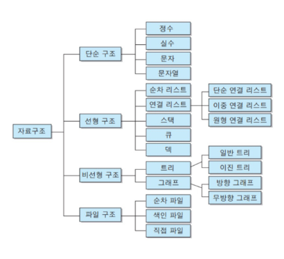
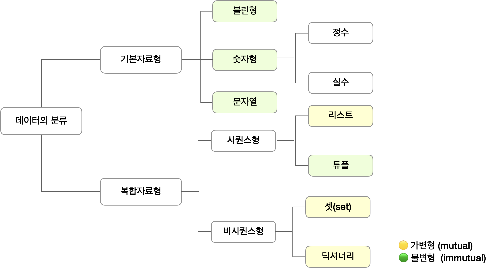

# 데이터 구조(Data Structure)

## 데이터 구조

- 데이터 구조의 개념
    - 여러 데이터를 효과적으로 사용, 관리하기 위한 구조 또는 저장형식
    - 파이썬에는 대표적으로 List, Tuple, Dict, Set 등의 데이터 구조가 있음
    - 컴퓨터공학에서는 ‘자료구조’라고 함
        
        
        
        
        
- 데이터 구조를 활용하기 위해서는 메서드(method)를 사용
    - 매서드는 클래스 내부에 정의한 함수, 사실상 함수 동일
    - 쉽게 설명하자면 객체의 기능(추후 객체 지향 프로그래밍에서 학습)
        - `데이터 구조.메서드()` 형태로 활용
    - 구글링하기 전, 파이썬 공식문서를 반드시 확인할 것!
        
        [Data Structures](https://docs.python.org/3/tutorial/datastructures.html?highlight=data%20structure)

</br>


## 순서가 있는 데이터 구조 - 문자열, 리스트, 튜플

- 문자열
    - 문자들의 나열(sequence of characters)
        - 변경할 수 없고(immutable), 순서가 있고(ordered), 순회 가능한(iterable)
    - 문자열은 작은 따옴표(’)나 큰 따옴표(”)를 활용하여 표기
        - 문자열을 묶을 때 동일한 문장부호 활용(PEP8)
    - 문자열 조회/탐색 및 검증 메서드(s는 문자열)
        - `s.find(x)`, `s.index(x)`,  `s.isalpha(x)`, `s.isupper()`,  `s.islower()`, `s.istitle()`
            - `s.find(x)` : x의 **첫 번째 위치**를 반환. 만일 리스트 내에 x가 없으면, `-1`
             반환
            - `s.index(x)` : x의 **첫 번째 위치**를 반환. 만일 x가 리스트 내에 없으면, 오류 발생
    - 문자열 변경 메서드
        - `s.replace(old, new[,count])`, `s.strip([chars])`, `s.split(sep=None, maxsplit=-1)`
            - chars 파라미터를 지정한 경우, “모든 조합을 이용하여” 제거합니다.
                
                ```python
                c = 'monty python'
                c.rstrip(' python') # 'm'
                ```
                
        - `‘separator’.join([iterable])`, `s.capitalize(), s.title()`
        - `s.upper()`, `s.lower()`, `s.swapcase()`
- 리스트(List)
    - 여러 개의 값을 순서가 있는 구조로 저장하고 싶을 때 사용
        - 대괄호([]) 혹은 list()를 통해 생성
            - 파이썬에서는 어떠한 자료형도 저장할 수 있으며, 리스트 안에 리스트도 넣을 수 있음
            - 생성된 이후 내용 변경이 가능 → 가변 자료형
            - 이러한 유연성 때문에 파이썬에서 가장 흔히 사용
    - 순서가 있는 시퀀스로 인덱스를 통해 접근 가능
    - 리스트 관련 메서드
        - `L.append(x)`, `L.insert(i, x)`
        - `L.remove(x)`, `L.pop()`, `L.pop(i)`
            - `L.remove(x)` : 리스트에서 값이 x인 첫번째 항목을 삭제. 만일 그런 항목이 없으면 `ValueError`발생.
            - `L.pop()` : 정해진 위치 `i`에 있는 값을 삭제하며, 그 항목을 반환. i가 지정되지 않으면 마지막 항목을 삭제하고 되돌려줌.
        - `L.extend(m)`, `L.index(x, start, end)`
        - `L.reverse()`
        - `L.sort()`는 원본 list를 변형시키고 None 을 리턴, `sorted(L)`는 원본 미변경(정렬된 리스트 반환)
        - `L.count(x)`
- 튜플(Tuple)
    - 여러 개의 값을 순서가 있는 구조로 저장하고 싶을 때 사용
        - 리스트와의 차이점은 생성 후, 담고 있는 값 변경이 불가 → 불변 자료형
            - 파이썬 내부에서 값을 다룰 때 주로 사용(리스트 순서를 보장해서 값을 반환해야 할 경우)되며 개발자들이 자주 사용하는 자료구조는 아님
        - 항상 소괄호 형태로 사용
    - 튜플 관련 메서드
        - 튜플은 변경할 수 없기 때문에 값에 영향을 미치지 않는 메서드만을 지원
        - 리스트 메서드 중 항목을 변경하는 메서드들을 제외하고 대부분 동일

- [참고] 연산자(Operator)
    - 멤버십 연산자(Membership Operator)
        - `in` : 특정 요소가 속해 있는지 여부를 확인
        - `in`, `not in` : 포함 여부 확인
        - 산술연산자(`+`) : 시퀀스 간의 concatenation(연결/연쇄)
        - 반복연산자(`*`) : 시퀀스를 반복

- Exercise!
    - 주어진 문자열에서 숫자, 문자, 기호가 각각 몇개인지를 판단하는 함수를 작성해보세요.
        
        ```python
        def check(target_str):
        	pass
        ```
        
    - 문자 : 10개, 숫자 : 2개, 기호 : 7개

</br>

## 실습 : 재귀 함수

- 재귀(recursive) 호출(call): 함수 내부에서 자기 자신을 또다시 호출하는 행위
    - 장점: 코드의 가독성이 올라간다.
    - 단점
        - 함수를 호출하는 데 걸리는 시간이 존재함
        - 재귀 호출은 함수를 여러 번 호출하기 때문에, 이 시간이 많이 발생함
        - 따라서, 시간복잡도가 중요한 문제(성능이 중요할 때)에서는 쓰지 말 것

- 예시
    - 정수값 n 을 입력받고 n 의 각 자리수의 합을 더해주는 함수
        
        ```python
        # 반복문 버전
        n = 12345
        result = 0
        
        while n > 0:
            result += n % 10
            n //= 10
        
        print(result)
        
        # 재귀함수 사용
        def sum_digits(n):
            if n < 10:
                return n
            
            # recursive case
            return sum_digits(n // 10) + (n % 10)
        ```
        
    - 정수값 n 을 입력받고 1~n 까지의 합을 구하는 재귀함수
        
        ```python
        # 반복문 버전
        n = 12345
        result = ''
        
        while n > 0:
            result = str(n%10) + result
            n //= 10
        
        print(result)
        
        # 재귀함수 사용
        def recursion(n):
            if n < 1:
                return 0
            return n + recursion(n-1)
        
        print(recursion(int(input())))
        ```
        
    - 피보나치 수열
        
        ```python
        # 반복문 예시
        n = 10
        result = 0
        pre_num = 0
        new_num = 1
        # 0 1 1 2 3 5 8 13 21 34
        
        if n == 1:
            print(0)
        elif n == 2:
            print(1)
        else:
            for i in range(3, n+1):
                tmp = pre_num + new_num
                pre_num = new_num
                new_num = tmp
            print(tmp)
        
        # 재귀함수 사용
        def fib(n):
            if n == 0:
                return 0
            elif n == 1 or n == 2:
                return 1
            else:
                return fib(n - 1) + fib(n - 2)
        ```
        
    - 2진수 변환하기
        
        ```python
        # 반복문 예시
        n = 16
        result = ''
        
        while n > 0:
            result = str(n%2) + result
            n //= 2
        
        print(result)
        
        # 재귀함수 사용
        def recursion(n):
            if n//2==0:
                return str(n)
            return recursion(n//2) + str(n%2)
        
        print(recursion(10))
        ```
        
    - 최대 공약수 ( 자주 나오는 문제 )
        - 유클리드 호제법 : a 와 b 의 최대 공약수는 b 와 (a % b) 의 최대 공약수와 같다. 어떤 수와 0의 최대 공약수는 자기자신이다.
        - 예시) gcd(120, 54)
        120 = 54 * 2 + 12 이므로 gcd(120, 54) = gcd(54, 12)
        54 = 12 * 4 + 6 이므로 gcd(54, 12) = gcd(12, 6)
        12 = 6 * 2 + 0 이므로 gcd(12, 6) = gcd(6, 0)
        따라서 gcd(120, 54) = gcd(6, 0) = 6
        - 코드로 나타내면 아래와 같다.
            
            ```python
            # 방법 1
            def gcd(a, b):
                if b == 0:
                    return a
                return gcd(b, a % b)
            
            # 방법 2
            def gcd(a, b):
                return gcd(b, a % b) if b != 0 else a
            ```
            
    - 추가적으로 `하노이의 탑` 문제도 재귀 호출 연습에 좋습니다.  
    나중에 배우게 될 `dfs 알고리즘` 에서 재귀 호출이 핵심적으로 사용되니, 반드시 알아둡시다 !