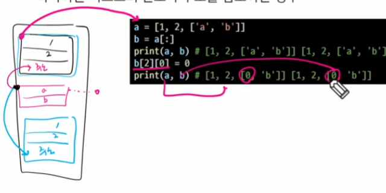
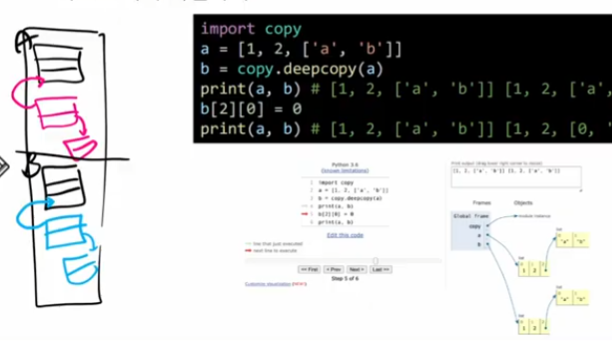
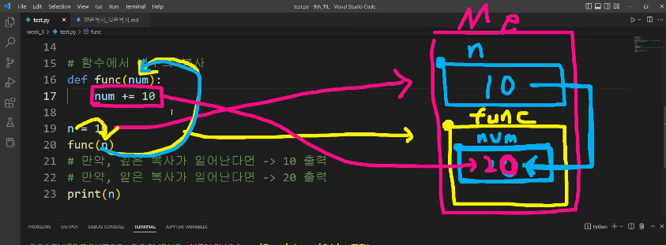

## 순서가 없는 데이터 구조

- 셋(Set)
    - Set이란 중복되는 요소가 없이, 순서에 상관없는 데이터들의 묶음
        - 데이터의 중복을 허용하지 않기 때문에 중복되는 원소가 있다면 하나만 저장
        - 순서가 없기 때문에 인덱스를 이용한 접근 불가능
    - 수학에서의 집합을 표현한 컨테이너
        - 집합 연산이 가능(여집합을 표현하는 연산자는 별도로 존재X)
        - 중복된 값이 존재하지 않음
    - 담고 있는 요소를 삽입 변경, 삭제 가능 → 가변 자료형(mutable)
    - 셋 관련 메서드(s는 셋)
        - `s.copy()`, `s.add(x)`
        - `s.remove(s)`, `s.discard(x)`
            - remove는 삭제하려는 요소가 없으면 KeyError, discard는 없어도 에러 미발생
        - `s.update(t)`
        - `s.pop()`, `s.clear()`,
        - `s.isdisjoint(t)`
            - 셋 s가 셋 t의 서로 같은 항목을 하나라도 갖고 있지 않은 경우 True 반환(서로소)
        - `s.issubset(t)`, `s.issuperset(t)`


- 딕셔너리(Dictionary)
    - 키-값(key-value) 쌍으로 이뤄진 자료형(3.7부터는 ordered, 이하 버전은 unordered)
    - Dictionary의 키(key)
        - key는 변경 불가능한 데이터(immutable)만 활용 가능
            - string, integer, float, boolean, tuple, range
    - 각 키의 값(values)
        - 어떤 형태든 관계 없음
    - 딕셔너리 관련 메서드(d는 딕셔너리)
        - `d.clear()`, `d.copy()`
        - `d.keys()`, `d.values()`, `d.items()`
        - `d.get(k)`, `d.get(k,v)`
            - 존재하지 않는 key를 가져올 때 `None` 반환
            - `d[’key’]` 의 경우 KeyError 나므로, get 함수 사용을 추천
        - `d.pop(k)`, `d.pop(k,v)`
        - `d.update([other])`

</br>

## 얕은 복사와 깊은 복사

- 얕은 복사는 ‘동일한 데이터에 대해’ 새로운 변수를 할당하는 것. 원본 데이터가 변경되어 코드의 로직 전체가 망가질 수 있음. 이때 다른 주소를 갖게 하고 싶다면(혹은 참조된 주소까지도 달리 하고 싶다면) 다른 메모리 공간에 복사해두면 되는데 이를 깊은 복사라 함. 자료를 수정해도 기존 자료는 수정되지 않음.
- 복사방법
    - **할당(Assignment)**
        - 대입 연산자(=)
            - 대입 연산자를 통한 복사는 해당 객체에 대한 객체 참조(즉, 주소값)를 복사
            - 해당 주소의 일부 값을 변경하는 경우 이를 참조하는 모든 변수에 영향
            
            ```
            original_list = [1, 2, 3]
            copy_list = original_list # 얕은 복사
            print(original_list, copy_list)
            
            copy_list[0] = 'hello'
            print(original_list, copy_list) # ['hello', 2, 3] ['hello', 2, 3]
            ```
            
    - **얕은 복사(Shallow copy)**
        - Slice 연산자 사용 [ : ] : 리스트를 슬라이싱하여 할당 시, 새로운 id가 부여되며, 서로 영향을 받지 않습니다.
            
            ```python
            a = [1, 2, 3]
            b = a[:]
            print(a, b)
            b[0] = 5
            print(a, b) # [1, 2, 3] [5, 2, 3]
            # 여기까진 깊은 복사와 같은 결과임
            ```
            
        - `list()` 활용
            
            ```python
            a = [1, 2, 3]
            b = list(a)
            b[0] =5
            print(a, b) # [1, 2, 3] [5, 2, 3]
            # 여기까진 깊은 복사와 같은 결과임
            ```
            
        - copy 모듈의 copy 메서드 사용
            
            ```python
            import copy
            a = [1, 2, [1,2]]
            b = copy.copy(a)
            b[1] = 99 -- 원본 미변경
            b[2][1] = 88 -- 원본 변경
            print(a) # [1, 2, [1, 88]]
            ```
            
        - 주의사항 : 복사하는 리스트의 원소가 주소를 참조하는 경우(ex. 2차원 리스트)
            - a와 b의 id는 다르다는 것을 확인하였지만, 내부 값은 영향을 받게 되었습니다.
            - 내부의 객체 `id(a[2])`과 `id(b[2])`은 같은 주소를 바라보고 있기 때문입니다.
            
            ```python
            a = [1, 2, ['a', 'b']]
            b = a[:]
            print(a, b)
            b[2][0] = 0
            print(a, b) # [1, 2, [0, 'b']] [1, 2, [0, 'b']]
            print(id(a), id(b)) # 2593233143872 2593233230720 -- 다름
            print(id(a[2]), id(b[2])) # 2188180241280 2188180241280 -- 같음
            
            # a는 데이터가 저장된 공간의 시작주소를 가리킴
            # a[2] 값은 리스트 자료형인데, 리스트 자체로 저장되는 것이 아니다.
            # 리스트 내의 원소를 어딘가에 따로 저장해두고 그 '주소'가 저장된다.
            # 즉, 1차원 상태 그대로를 복사함.
            
            # a[:]를 복사하면, '1, 2, 주소'가 다른 공간에 저장된다.
            # 이때 a[2], b[2]는 동일한 주소를 가리키고 있으므로,
            # b[2][0] 값을 수정하면 a[2][0]도 동일하게 수정된다.
            ```
            
            
            
    - **깊은 복사(Deep copy)**
        - 파이썬 내장 모듈 **copy의** deepcopy 메소드 사용
            
            ```python
            import copy
            a = [1, 2, ['a', 'b']]
            b = copy.deepcopy(a)
            print(a, b)
            b[2][0] = 0
            print(a, b) # [1, 2, ['a', 'b']] [1, 2, [0, 'b']]
            
            # 몇 차원이든 리스트의 깊은 복사가 이루어짐
            ```
            
            
            
- 결론
    - 리스트를 복사하고 싶다는 욕망이 든다면 **“무조건 print 찍어볼 것!”**
        - “주석”과 “print (디버깅용)”은 습관이다.
    - 혹은 디버깅 툴로 리스트 변화를 확인할 것.
        - IDE
        - [주의] pycharm 디버깅 → 윈도우 전용(리눅스 환경에서는 안돌아감)
    - 그냥 모두 copy.deepcopy() 쓰면 되는 것 아닌가요? - ㄴㄴ. 메모리 용량 증가.

</br>

## [실습 1] 리스트 정렬 시 기준 설정 방법

```python
test_list = [1, 2, 3, 7, 4, 6, 5]
test_list.sort()
print(test_list) # [1, 2, 3, 4, 5, 6, 7]

scores = [('eng', 88), ('sci', 90), ('math', 80)]
# 정렬 
print(scores)
scores.sort() # 맨 앞의 값을 기준으로 정렬
print(scores) # [('eng', 88), ('math', 80), ('sci', 90)]

# 점수 기준으로 정렬
# def 함수 사용
def check(x):
    return x[1]

scores.sort(key=check)

scores.sort()
print(scores) # [('math', 80), ('eng', 88), ('sci', 90)]

# lambda 함수 사용
scores.sort(key=lambda x: x[1])
print(scores) # [('math', 80), ('eng', 88), ('sci', 90)]
```

</br>

## [실습 2] 얕은 복사와 깊은 복사, 람다함수의 활용

```python
# 리스트에서 깊은 복사를 하는 방법
import copy
a = [1, 2, 3]
b = a.copy()
b = 10
print(a) # [1, 2, 3]

# 리스트 내부의 모든 복사를 깊은 복사로 변경
b = copy.deepcopy(a)
b= 10
print(a) # [1, 2, 3]

li = [1, 4, 2, 3, 5, 3]

# 원본 함수를 변경시켜줌
li.sort()
li.sort(reverse=True)
# 정렬된 함수를 반환시켜줌
new_li = sorted(li)
```



```python
# sorted : 리스트에 대한 불완전한 깊은 복사가 일어남
li = [1, 4, 2, 3, 6, 4]
new_li = sorted(li)
new_li[0] = 10
print(new_li) # [10, 2, 3, 4, 4, 6]
print(li) # [1, 4, 2, 3, 6, 4]

li = [[1,2], [4, 2], [3, 6]] # 2차원 리스트
new_li = sorted(li) 
new_li[0][0] = 10
print(new_li) # [[10, 2], [3, 6], [4, 2]]
print(li) # [[10, 2], [4, 2], [3, 6]]
```

```python
# 람다 함수
# 특징: 가독성이 떨어지지 않으면서 일회용 함수로서 기능
li = [[9, '가'], [2, '바'], [7, '다'], [5, '나']]
# li.sort()
# print(li) # [[2, '바'], [5, '나'], [7, '다'], [9, '가']]

li.sort(key=lambda element: element[1])
print(li) # [[9, '가'], [5, '나'], [7, '다'], [2, '바']]
```

</br>

## [실습 3] 소수 구하기

1. n-1까지 나눠서 0인지 여부로 판별
2. 루트 n 까지 범위로 제한해 나머지가 0인지 여부로 판별
3. 에라토스테네스의 체
4. 시간복잡도 더 줄이기 위해 -> 폴라드 로


</br>

## 참고 자료

- 코드업100제, 백준 단계별로 풀어보기, 프로그래머스 난이도 1,2, SWEA 난이도 1,2(추천)

- [Python Tutorial](https://www.w3schools.com/python/default.asp)