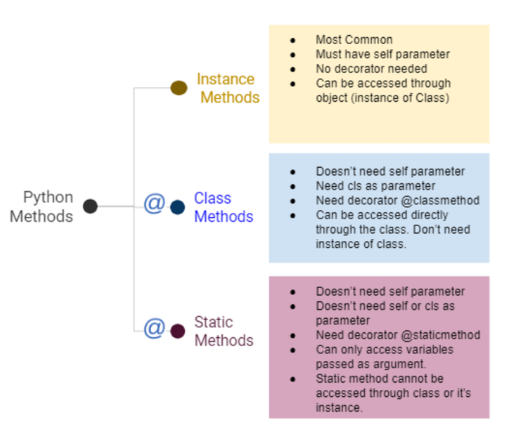

## 객체 지향 프로그래밍

- 객체 지향 프로그래밍이란?
    - 객체 지향 프로그래밍(Object-Oriented Programming, OOP)이란 컴퓨터 프로그래밍의 패러다임 중 하나
    - 컴퓨터 프로그램을 명령어의 목록으로 보는 시각에서 벗어나 여러 개의 독립된 단위, 즉 ‘객체’들의 모임으로 파악하고자 하는 것. 각각의 객체는 메세지를 주고받고, 데이터를 처리할 수 있음.
- 절차 지향 프로그래밍
    - 프로그램 전체가 유기적인 흐름으로 연결 / 기능 중심의 프로그램 / 순서가 정해져 있으므로 실행이 빠름
    - 하드웨어가 발전함에 따라 소프트웨어도 점점 커지고 복잡한 설계가 요구됨 → 하드웨어의 발전 속도를 소프트웨어의 발전 속도가 따라가지 못함 : “소프트웨어 위기(Software Crisis)”
    - 절차 지향 방법론은 생산성이 너무 낮음 → ‘절차’ 대신 핵심이 되는 ‘데이터’를 중심으로 생각하자!
    - 데이터를 중심으로 절차를 도입해서 현실의 사물을 나타내고 이런 것들을 조립하는 방식으로 개발하자 == OOP
- 객체 지향 프로그래밍
    - 프로그램을 여러 개의 **독립된 객체들과 그 객체 간의 상호작용**으로 파악하는 프로그래밍 방법
        - 절차 지향 프로그래밍은 심장이 있어야만 팔다리가 작동했다면, 객체 지향 프로그래밍은 심장이 있음을 가정하고 팔다리를 기능하게 함 → **Bottom-Up** 방식
        - Python, Java, C++, C# 등
    - 데이터와 기능(메서드) 분리, 추상화된 구조(인터페이스)
    - 객체 지향 프로그래밍이 필요한 이유? - 현실 세계를 프로그램 설계에 반영(추상화)
        - 자료 추상화? == 불필요한 정보는 숨기고 중요한 정보만을 표현함으로써 프로그램을 간단히 만드는 것
- 장단점
    - 장점
        - 객체는 잘 만들어놓으면 계속해서 재사용이 가능!
        - 객체는 그 자체로 데이터와 행동이 정의됨(독립적) == 개발자가 내부 구조를 몰라도 그냥 가져다가 다른 객체와 조립하면서 개발이 가능
        - 객체 단위로 모듈화시켜 개발할 수 있으므로 많은 인원이 참여하는 대규모 소프트웨어 개발 가능
        - 개발 용이성, 유지 보수 편의성, 신뢰성을 바탕으로 **생산성**이 대폭 증가!
    - 단점
        - 설계 시 많은 노력과 시간이 필요함
            - 다양한 객체들이 상호작용 구조를 만들기 위해 많은 시간과 노력이 필요
        - 실행 속도가 상대적으로 느림
            - 절차 지향 프로그래밍이 컴퓨터의 처리구조와 비슷해서 실행 속도가 빠름

</br>

## OOP 기초

- 객체
    - 컴퓨터 과학에서 객체 또는 오브젝트(object)는 **클래스에서 정의한 것을 토대로 메모리(실제 저장공간)에 할당된 것**으로 프로그램에서 사용되는 데이터 또는 식별자에 의해 참조되는 공간을 의미하며, 변수, 자료 구조, 함수 또는 메서드가 될 수 있다.
        - 객체는 **속성**과 **행동**으로 구성된 모든 것
- 클래스와 객체
    - 클래스(설계도)와 객체(실제 사례) : 클래스를 가지고 여러 객체를 찍어낼 수 있음
    - 클래스로 만든 객체를 인스턴스라고도 함
    - 파이썬은 모든 것이 객체(object)다!
    - 함수는 기능만 하고 끝나는 반면, 클래스는 데이터와 함수를 하나로 묶어줌
- 객체(object)의 특징
    - 타입(type): 어떤 연산자(operator)와 조작(method)이 가능한가?
    - 속성(attribute): 어떤 상태(데이터)를 가지는가?
    - 조작법(method): 어떤 행위(함수)를 할 수 있는가?

</br>


## 객체와 클래스 문법

- 기본 문법
    
    ```python
    # 클래스 정의 -- 나만의 타입을 만드는 것!
    class MyClass:
    	pass
    
    # 인스턴스 생성
    my_instance = MyClass()
    
    # 메서드 호출
    my_instance.my_method()
    
    # 속성 접근
    my_instance.my_attribute
    ```
    
- 예시
    
    ```python
    class Person:
    	pass
    
    print(type(Person)) # <class 'type'>
    # Person이라는 클래스는 사실 type이라는 클래스의 인스턴스였다!
    
    person1 = Person()
    
    print(isinstance(person1, Person)) # True
    print(type(person1)) # <class '__main__.Person'>
    ```
    
- 파이썬은 모든 것이 객체, 모든 객체는 특정 타입(객체)의 인스턴스

- 객체 비교하기
    - ==
        - 동등한(equal)
        - 변수가 참조하는 객체가 동등한(내용이 같은) 경우 True
        - 두 객체가 같아 보이지만 실제로 동일한 대상을 가리키고 있다고 확인해준 것은 아님
    - is
        - 동일한(identical)
        - 두 변수가 동일한 객체를 가리키는 경우 True
            
            ```python
            a = [1, 2, 3]
            b = [1, 2, 3]
            print(a == b, a is b) # True False
            
            a = [1, 2, 3]
            b = a
            print(a == b, a is b) # True True
            ```
            

- 속성
    - 특정 데이터 타입/클래스의 객체들이 가지게 될 상태/데이터를 의미
    - 클래스 변수 / 인스턴스 변수가 존재
- 인스턴스와 클래스 간의 이름 공간(namespace)
    - 클래스를 정의하면, 클래스와 해당하는 이름 공간 생성
    - 인스턴스를 만들면, 인스턴스 객체가 생성되고 이름 공간 생성
    - 인스턴스에서 특정 속성에 접근하면, 인스턴스-클래스 순으로 탐색

- 인스턴스 변수
    - 인스턴스 변수란?
        - 인스턴스가 개인적으로 가지고 있는 속성(attribute)
        - 각 인스턴스들의 고유한 변수
    - 생성자 메서드(__init__)에서 self.<name>으로 정의
        - 생성자 메서드: 클래스를 생성할 때 부르는 함수
    - 인스턴스가 생성된 이후 <instance>, <name>으로 접근 및 할당
        
        ```python
        class Person:
            # 인스턴스 변수 정의(클래스를 정의하면 자동적으로 아래 함수가 불러와지며, 인스턴스가 생성될 때 호출됨)
            def __init__(self, name):
                self.name = name
            
        john = Person('john') # 괄호 안의 john이 __init__ 파라미터인 name에 들어감
        print(john.name) # john
        john.name = 'John Kim'
        print(john.name) # John Kim
        ```
        

- 클래스 변수
    - 한 클래스의 모든 인스턴스가 공유하는 값을 의미
    - 같은 클래스의 인스턴스들은 같은 값을 갖게 됨
    - 클래스 내부에서 정의 - <classname>.<name>으로 접근 및 할당
    - 클래스 변수 활용(사용자 수 계산하기)
        
        ```python
        class Person:
            count = 0
            # 인스턴스 변수 설정
            def __init__(self, name): #self(인스턴스 자기 자신)에 name이라는 데이터를 넣어줘
                self.name = name
                Person.count += 1
            
        # 인스턴스 변수 각각이 생성됨
        person1 = Person('아이유')
        person2 = Person('이찬혁')
        
        print(Person.count)
        ```
        

- 인스턴스 변수와 클래스 변수
    - 여러 인스턴스 간에 서로 공유해야 하는 값은 클래스 변수를 통해 바인딩해야 함
    - 왜냐하면 파이썬은 인스턴스의 네임스페이스에 없는 이름은 클래스의 네임스페이스에서 찾아보기 때문에 이러한 특성을 이용하면 클래스 변수가 모든 인스턴스에 공유될 수 있기 때문


</br>

## OOP 메서드

- 메서드
    - 특정 데이터 타입/클래스의 객체에 공통적으로 적용가능한 행위(함수)
        
        ```python
        class Person:
            # '인스턴스' 메서드 생성
            def talk(self):
                print('안녕')
            
            def eat(self, food):
                print(f'{food}를 냠냠')
        
        person1 = Person()
        person1.talk() # 안녕
        person1.eat('피자') # 피자를 냠냠
        person1.eat('치킨') # 치킨를 냠냠
        ```
        
        - 종류
        
             
        
        - 인스턴스 메서드: 인스턴스 변수를 사용하는 함수(가장 일반적인 메서드)
            - 호출 시, 첫번째 인자로 인스턴스 자기자신(self)이 전달되게 설계
                - 매개변수 이름으로 self를 첫 번째 인자로 정의
                - 다른 단어로 써도 작동하지만, 파이썬의 암묵적인 규칙
            - 특별한 인스턴스 메서드: 매직 메서드(magic method)
                - Double underscore(__)가 있는 메서드는 특수한 동작을 위해 만들어진 메서드로, 스페셜 메서드 혹은 매직 메서드라 불림
                - 특정 상황에 자동으로 불리는 메서드
                - 예시
                    - `__init__(self)` : 인스턴스 객체가 생성될 때 자동으로 호출되는 메서드
                    - `__str__(self)` : 이 객체를 문자열로 표현하면 어떻게 표현할지를 지정(print함수 등에서 객체를 출력하면 자동으로 호출되는 메서드)
                    - `__gt__(self)` : 부등호 연산자(>, greater than)
                        
                        ```python
                        class Person:
                            def __init__(self):
                                print('생성될 때 자동으로 불려요')
                        
                        aiden = Person() # 생성될 때 자동으로 불려요
                        ```
                        
                        ```python
                        class Person:
                            def __init__(self, name, age):
                                print('생성될 때 자동으로 불려요')
                                # 모든 사람의 이름과 나이가 어쨌든 필요!
                                self.name = name
                                self.age = age
                        
                            def __str__(self):
                                return '이 클래스를 하나의 문자열로 표현하면 이겁니다'
                        
                        aiden = Person('aiden', 23)
                        issac = Person('issac', 19)
                        print(aiden) # 이 클래스를 하나의 문자열로 표현하면 이겁니다
                        
                        # 이렇게 해도 되지만 모든 사람의 이름과 나이가 필요한 경우엔 위의 방법 사용
                        # aiden = Person()
                        # aiden.name = 'aiden'
                        # aiden.age = 23
                        ```
                        
                        ```python
                        class Circle:
                        
                            def __init__(self, r):
                                self.r = r
                            
                            def area(self):
                                return 3.14 * self.r * self.r
                            
                            def __str__(self):
                                return f'[원] radius: {self.r}'
                        
                            def __gt__(self, other): 
                                return self.r > other.r
                        
                        c1 = Circle(10)
                        c2 = Circle(1)
                        
                        print(c1) # [원] radius: 10
                        print(c2) # [원] radius: 1
                        print(c1 > c2) # True
                        print(c1 < c2) # False
                        ```
                        
        - 클래스 메서드: 클래스 변수를 사용하는 함수
            - 클래스가 사용할 메서드
            - `@classmethod` 데코레이터를 사용하여 정의
            - 호출 시, 첫번째 인자로 클래스(cls)가 전달됨
                
                ```python
                class Person:
                    count = 0
                
                    def __init__(self, name):
                        self.name = name
                        Person.count += 1
                    
                    @classmethod
                    # 인스턴스와 전혀 관련이 없는 클래스 메서드
                    def number_of_population(cls):
                        print(f'인구수는 {cls.count}입니다')
                
                person1 = Person('아이유')
                person2 = Person('이찬혁')
                
                Person.number_of_population() # 인구수는 2입니다
                person1.number_of_population() # 인구수는 2입니다
                person2.number_of_population() # 인구수는 2입니다
                ```
                
        - 정적 메서드: 인스턴스와 클래스 모두를 활용하지 않는 함수

</br>

## 추가 실습

- 클래스와 인스턴스의 차이
    - 클래스 변수는 클래스의 네임스페이스에 위치하며, self.name과 같은 인스턴스 변수는 인스턴스의 네임스페이스에 위치

[점프 투 파이썬](https://wikidocs.net/1744)

```python
# 클래스 정의
class Singer():
    name = '이찬혁'
    #생성자 - 인스턴스가 생성될 때 호출
    def __init__(self):
        print('생성자')
        
# 인스턴스 정의
이찬혁 = Singer() # 생성자
이수현 = Singer() # 생성자
금기륜 = Singer() # 생성자

print(이찬혁.name) # 이찬혁
print(이수현.name) # 이찬혁
```

```python
class Singer():
    # 초기화 코드를 넣는 부분
		# self = 인스턴스 내부 네임스페이스
    # self.name = 인스턴스 변수 정의
    def __init__(self, name):
        self.name = name # 인스턴스 변수에 name 파라미터를 넣어줌

이찬혁 = Singer('이찬혁')
이수현 = Singer('이수현')

print(이찬혁.name) # 이찬혁
print(이수현.name) # 이수현
```

- 인스턴스와 객체의 차이
    - 프로그램 코드 상에서 자료형이 임의의 **클래스로 선언**된 식별자는 '객체'라 하고, 코드 컴파일 후 프로그램이 실행될 때 해당 객체가 **메모리에 적재**되면 '인스턴스'라고 불림. ( Java는 '객체'를 뜻하는 영단어 Object로 명명된 클래스가 존재하기 때문에, 구분을 위하여 인스턴스라는 표현을 공식적으로 사용) → 어느 단계를 기준으로 하느냐의 차이일 뿐 객체와 인스턴스는 같은 것이라고 할 수 있다.
- 데일리 실습 예제(7-1)
    
    ```python
    class Nationality:
        # 초기화(생성자)
        def __init__(self, nationality):
            # 인스턴스 변수 선언
            self.nationality = nationality
        
    korea_nationality = Nationality("대한민국")
    print(korea_nationality) # <__main__.Nationality object at 0x00000236A93E6A90>
    print(korea_nationality.__str__()) # <__main__.Nationality object at 0x00000236A93E6A90>
    
    # 매직 메서드 등 모든 객체의 정보 출력
    # 매직 메서드: 특정 상황에 자동으로 호출되는 함수
    print(dir(korea_nationality))
    ```
    
    ```python
    class Nationality:
        # 초기화(생성자)
        def __init__(self, nationality):
            # 인스턴스 변수 선언
            self.nationality = nationality
        
        # 매직 메서드 재정의
        # 재정의란 기존에 있던 함수를 '덮어쓰기' 하는 동작
        # print 함수 호출 시
            # 원래 Nationality 객체가 가지고 있는 __str__ 함수가 아닌,
            # 내가 새로 정의한 __str__를 호출한다.
    
        def __str__(self):
            return f'나의 국적은 {self.nationality}'
            # return '나의 국적은' + self.nationality
        
    korea_nationality = Nationality('대한민국')
    usa_nationality = Nationality('미국')
    china_nationality = Nationality('중국')
    
    print(korea_nationality) # 나의 국적은 대한민국
    print(usa_nationality) # 나의 국적은 미국
    print(china_nationality) # 나의 국적은 중국
    ```
    
    ```python
    class Nationality:
        count = 0
    
        def __init__(self, nationality, population):
            # 인스턴스 변수 선언
            self.nationality = nationality
            self.population = population
            Nationality.count += 1
    
        # 인스턴스 메서드
        # 인스턴스 레벨에서 사용함
        #   -> 인스턴스가 가진 데이터를 다룸
        # 클래스 변수, 인스턴스 변수 모두 사용가능
        def get_population(self):
            print(f'{self.nationality} - {self.population}')
        
        # 클래스 메서드
        # 클래스 변수만 사용가능한 메서드 - 인스턴스 변수 사용 시 에러
        @classmethod
        def get_count(cls):
            print(f'전체 나라 수는 {cls.count}입니다.') 
            # 왜 return이 아니라 print 함수인지? -- 반환이 필요한 경우가 아니기 때문(그냥 찍어볼려고 한거임)
    
        # 둘 다 아닌 경우
        #   -> 인스턴스 변수, 클래스 변수 모두 사용하지 않는 메서드
        # 변수는 안 써도, 문맥상 해당 클래스에 포함된다고 판단될 때(개발자 편의를 위함)
        # static method는 클래스 밖에서 선언해도 전혀 문제없으며, 동작도 동일함
        @staticmethod
        def print_test():
            print('print_test')
    
        def __del__(self):
            print('소멸자 호출')
    
    korea_nationality = Nationality('대한민국', 5174)
    usa_nationality = Nationality('미국', 33190)
    china_nationality = Nationality('중국', 141200)
    
    korea_nationality.get_population() # 대한민국 - 5174
    
    # 클래스 변수 접근은 인스턴스, 클래스 둘 모두에서 에러가 발생하지 않는다.
    # 인스턴스로 클래스 변수 접근    
    print(korea_nationality.count) # 3
    print(usa_nationality.count) # 3
    print(china_nationality.count) # 3
    # 클래스 자체로 클래스 변수 접근
    print(Nationality.count) # 3
    
    Nationality.get_count() # 전체 나라 수는 3입니다.
    
    # 메모리에서 영역 삭제
    del china_nationality
    # 메모리에서 china_nationality 변수를 찾을 수 없으니 is not defined 에러 발생
    # china_nationality.get_population()
    Nationality.get_count()
    ```
    

- 중요 포인트
    1. 클래스와 인스턴스의 차이 
    2. 클래스 변수와 인스턴스 변수의 차이점
    3. 클래스 메서드, 인스턴스 메서드, 스태틱 메서드
    4. 생성자와 소멸자의 개념
        1. 재정의 개념(내일 다시 배움)

- 데코레이터
    - 간단하게 할 수 있다
    - 메인 기능이 눈에 안들어오거나, 파라미터가 있을 때 작성하기 힘들다
    - 예시: 사전, 사후 동작 추가하기
        - 데코레이터를 사용하지 않는 경우
            
            ```python
            # 기본 로직
            def func1():
                print('func1')
            
            def func2():
                print('func2')
            
            # 사전 사후 동작이 필요할 때 - 간단한 방법
            def wrapper(func):
                print('함수시작')
                func()
                print('함수끝')
            
            func1()
            func2()
            
            # 감싸니까 "메인 기능"이 눈에 안들어온다.
            wrapper(func1)
            wrapper(func2)
            ```
            
        - 데코레이터를 사용하는 경우
            
            ```python
            def my_decorator(func):
                # 감싸주는 함수
                def wrapper():
                    # 사전동작
                    print('함수시작')
                    # 메인 로직
                    func()
                    # 사후동작
                    print('함수끝')
                # 감싸주는 함수 반환
                return wrapper
            
            # 데코레이터로 감싼다
            @my_decorator
            def func3():
                print('func3')
            
            func3()
            ```
            

- 막간 Quiz
    - 개발자가 코드를 짤 때 어떤 관점을 가지고 짜느냐에 관한 이론: `프로그래밍 패러다임`
    - 크게 3가지 정도가 유명한데, `절차지향` → `객체지향` → `함수형 프로그래밍` 순으로 발전
        - 함수형 프로그래밍이란 ‘순수함수를 조합하고 소프트웨어를 만드는 방식’
    - 절차지향의 가장 큰 장점은 실행속도가 빠르다이다.
    - 객체지향의 가장 큰 장점은 재사용성, 생산성이다.