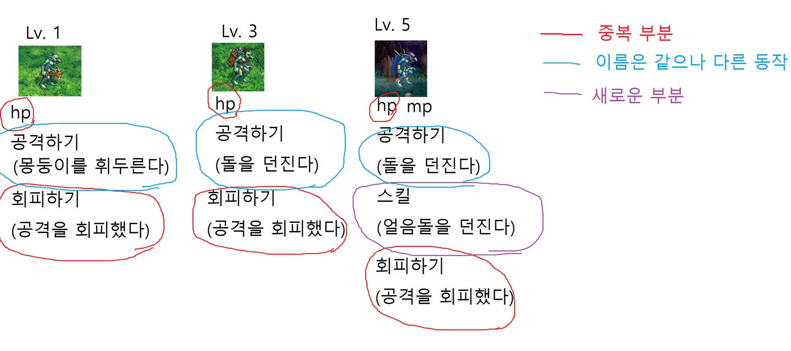

## 클래스 메서드

- 클래스가 사용할 메서드
- `@classmethod` 데코레이터를 사용하여 정의
- 호출 시 첫번째 인자로 클래스(cls)가 전달됨
    
    ```python
    class Person:
        count = 0 # 클래스 변수
        def __init__(self, name): # 인스턴스 변수 생성
            self.name = name
            Person.count += 1
        
        @classmethod
        def number_of_population(cls):
            print(f'인구수는 {cls.count}입니다.')
    
    person1 = Person('아이유')
    person2 = Person('이찬혁')
    
    Person.number_of_population()
    person1.number_of_population()
    person2.number_of_population()
    ```

</br>

## 데코레이터

- 함수를 어떤 함수로 꾸며서 새로운 기능을 부여
- `@데코레이터(함수명)` 형태로 함수 위에 작성
- 순서대로 적용되기 때문에 작성 순서가 중요
    
    ```python
    # 방법 1
    def ko_hello(name):
        print(f'안녕하세요, {name}님')
    
    def en_hello(name):
        print(f'Hello, {name}!')
    
    # def add_emoji(name, func):
    #     func(name)
    #     print('^~^//')
    
    # add_emoji('aiden', ko_hello)
    # add_emoji('aiden', en_hello)
    
    # 방법 2
    def emoji_decorator(func):
        def wrapper(name):
            func(name)
            print('^~^//')
       
        return wrapper
    
    # new_func = emoji_decorator(ko_hello)
    # new_func('aiden')
    
    # (emoji_decorator(ko_hello))('aiden')
    
    # (emoji_decorator(en_hello))('yeonju')
    
    @emoji_decorator
    def ko_hello(name):
        print(f'안녕하세요, {name}님')
    
    @emoji_decorator
    def en_hello(name):
        print(f'Hello, {name}!')
    
    ko_hello('aiden')
    ```
    

</br>

## 클래스 메서드와 인스턴스 메서드

- 클래스 메서드 → 클래스 변수 사용
- 인스턴스 메서드 → 인스턴스 변수 사용
- 그렇다면 인스턴스 변수, 클래스 변수 모두 사용하고 싶다면?
    - 클래스는 인스턴스 변수 사용이 불가능
    - 인스턴스 메서드는 클래스 변수, 인스턴스 변수 둘다 사용가능

</br>


## 스태틱 메서드

- 언제 사용하는가?
    - 속성을 다루지 않고 단지 기능(행동)만을 하는 메서드를 정의할 때 사용
- 스태틱 메서드
    - 인스턴스 변수, 클래스 변수를 전혀 다루지 않는 메서드(cls, self  사용 X)
    - 즉 객체 상태나 클래스 상태를 수정할 수 없음
    - `@staticmethod` 데코레이터를 사용하여 정의
    - 일반 함수처럼 동작하지만, 클래스의 이름공간에 귀속됨
        - 주로 해당 클래스로 한정하는 용도로 사용
        
        ```python
        class MyClass:
        
            def method(self):
                return 'instance method', self
            
            @classmethod
            def classmethod(cls):
                return 'class method', cls
            
            @staticmethod # 스태틱은 cls, self 사용 X
            def staticmethod():
                return 'static method'
            
        my_class = MyClass()
        print(my_class.method()) # ('instance method', <__main__.MyClass object at 0x0000021A6AB8B4F0>)
        print(my_class.classmethod()) # ('class method', <class '__main__.MyClass'>)
        print(my_class.staticmethod()) # static method
        ```
        
- 인스턴스 변수→  인스턴스, 클래스, 스태틱 메서드 모두 접근 가능
- 클래스 변수 → 클래스, 스태틱 메서드 접근 가능


</br>


# 객체 지향 프로그래밍

## 객체지향의 핵심개념

- 추상화
- 상속
    - 하위 클래스는 상위 클래스에 정의된 속성, 행동, 관계 및 제약조건을 모두 상속받음
    - 부모 클래스의 속성, 메서드가 자식 클래스에 상속되므로, 코드 재사용성이 높아짐
        
        ```python
        class Person:
            def __init__(self, name, age):
                self.name = name
                self.age = age
            
            def talk(self):
                print(f'반갑습니다. {self.name}입니다.')
        
        class Professor(Person):
            def __init__(self, name, age, department):
                self.name = name
                self.age = age
                self.department = department
        
        class Student(Person):
            def __init__(self, name, age, gpa):
                self.name = name
                self.age = age
                self.gpa = gpa
        
        p1 = Professor('박교수', 49, '컴퓨터공학과')
        s1 = Student('김학생', 20, 3.5)
        
        # 부모 클래스(Person)의 talk 메서드 활용
        p1.talk() # 반갑습니다. 박교수입니다.
        s1.talk() # 반갑습니다. 김학생입니다.
        ```
        
    - 정리
        - 파이썬의 모든 클래스는 object로부터 상속됨
        - 부모 클래스의 모든 요소(속성, 메서드)가 상속됨
        - `super()`를 통해 부모 클래스의 요소를 호출할 수 있음
        - 메서드 오버라이딩을 통해 자식 클래스에서 재정의 가능함
        - 상속관계에서의 이름공간은 인스턴스, 자식 클래스, 부모 클래스 순으로 탐색
    - 다중 상속
        - 두 개 이상의 클래스를 상속받는 경우
        - 상속받은 모든 클래스의 요소를 활용가능함
        - 중복된 속성이나 메서드가 있는 경우 **상속 순서**에 의해 결정됨
            
            ```python
            class Person:
                def __init__(self, name):
                    self.name = name
                
                def greeting(self):
                    return f'안녕, {self.name}'
            
            class Mom(Person):
                gene = 'XX'
            
                def swim(self):
                    return '엄마가 수영'
            
            class Dad(Person):
                gene = 'XY'
                def walk(self):
                    return '아빠가 걷기'
            
            class FirstChild(Dad, Mom):
                def swim(self):
                    return '첫째가 수영'
                def cry(self):
                    return '첫째가 응애'
            
            baby1 = FirstChild('아가')
            print(baby1.cry()) # 첫째가 응애
            print(baby1.swim()) # 첫째가 수영
            print(baby1.walk()) # 아빠가 걷기
            print(baby1.gene) # XY
            ```
            
        - mro 메서드(Method Resolution Order)
            - 해당 인스턴스의 클래스가 어떤 부모 클래스를 가지는지 확인하는 메서드
            - 기존의 인스턴스 → 클래스 순으로 이름 공간을 탐색하는 과정에서 상속관계에 있으면 인스턴스→ 자식 클래스 → 부모 클래스로 확장
- 다형성
    - 서로 다른 클래스에 속해있는 객체들이 동일한 메세지에 대해 다른 방식으로 응답할 수 있음
    - 메서드 오버라이딩
        - 상속받은 메서드를 재정의  : 클래스 상속 시, 부모 클래스에서 정의한 메서드를 자식 클래스에서 변경. 부모 클래스의 메서드 이름과 기본 기능은 그대로 사용하지만 특정 기능을 바꾸고 싶을 때 사용
        - 상속받은 클래스에서 같은 이름의 메서드로 덮어쓰며, 부모 클래스의 메서드를 실행시키고 싶은 경우 super를 활용
- 캡슐화
    - 객체의 일부 구현내용에 대해 외부로부터의 직접적인 액세스를 차단
    - 접근제어자 종류
        - Public Access Modifier - 모두 가능
            - 언더바 없이 시작하는 메서드나 속성
            - 어디서나 호출이 가능, 하위 클래스 override 허용
            - 일반적으로 작성되는 메서드와 속성의 대다수를 차지
        - Protected Access Modifier - 상속 관계에서만 가능
            - 언더바 1개로 시작하는 메서드나 속성
            - 암묵적 규칙에 의해 부모 클래스 내부와 자식 클래스에서만 호출 가능
            - 하위 클래스 override 허용
                
                ```python
                class Person:
                    def __init__(self, name, age):
                        self.name = name
                        self._age = age
                    
                    def get_age(self):
                        return self._age
                
                p1 = Person('김싸피', 30)
                print(p1.get_age()) # 30
                print(p1._age) # 30 -- 암묵적으로 활용
                ```
                
        - Private Access Modifier - 나만 가능
            - 언더바 2개로 시작하는 메서드나 속성
            - 본 클래스 내부에서만 사용 가능
            - 하위 클래스 상속 및 호출 불가능
            - 외부 호출 불가능
                
                ```python
                class Person:
                    def __init__(self, name, age):
                        self.name = name
                        self.__age = age
                    
                    def get_age(self):
                        return self.__age
                
                p1 = Person('김싸피', 30)
                # 인스턴스를 만들고 get_age 메서드를 활용하여 호출할 수 있다.
                print(p1.get_age()) # 30
                # __age에 직접 접근이 불가능하다.
                print(p1.__age) # 30 --  AttributeError : 'Person' object has no attribute '__age'
                ```
                
    - getter 메서드와 setter 메서드
        - 변수에 접근할 수 있는 메서드를 별도로 생성
            - getter 메서드 : 변수의 값을 읽는 메서드
                - @property 데코레이터 사용
            - setter 메서드 : 변수의 값을 설정하는 성격의 메서드
                - @변수. setter 사용
            
            ```python
            class Person:
                def __init__(self):
                    self._age = 0
                
                def get_age(self): # getter
                    print('getter 호출!')
                    return self._age
                
                def set_age(self, age): # setter
                    print('setter 호출!')
                    self._age = age
                
                age = property(get_age, set_age)
            
            # p1 = Person()
            # p1._age = 25 # 이렇게 하지 말자
            # print(p1._age) # 이렇게 하지 말자
            
            # # 불편행 ...
            # p1.set_age(25) 
            # print(p1.get_age())
            
            p1 = Person()
            p1.age = 25
            print(p1.age)
            ```
            
            ```python
            class Person:
                def __init__(self):
                    self._age = 0
                
                @property
                def age(self): # getter
                    print('getter 호출!')
                    return self._age
                
                @age.setter
                def age(self, age): # setter
                    print('setter 호출!')
                    self._age = age
            
            # p1 = Person()
            # p1._age = 25 # 이렇게 하지 말자
            # print(p1._age) # 이렇게 하지 말자
            
            # # 불편행 ...
            # p1.set_age(25) 
            # print(p1.get_age())
            
            p1 = Person()
            p1.age = 25
            print(p1.age)
            
            '''
             setter 호출!
            getter 호출!
            25
            setter 호출!
            getter 호출!
            25
            '''
            ```
            

</br>


# 에러와 예외처리

## 디버깅

- 잘못된 프로그램을 수정하는 것: de(없앤다) + bugging(버그)
    - print 함수 활용
    - 개발환경(text editor, IDE 등~~)~~에서 제공하는 기능 활용
    - Python tutor 활용
    
</br>


## 에러와 예외

- 문법 에러(Syntax Error)
    - 파이썬 프로그램은 실행되지 않음
- 예외(Exception)
    - 실행 중 감지되는 에러들을 예외라고 부르며, 예외는 여러 타입(type)을 나타나고 타입이 메세지의 일부로 출력됨
    - 모든 내장 예외는 Exception Class를 상속받아 이뤄짐
    - 사용자 정의 예외를 만들어 관리할 수 있음
    - ZeroDivisionError, NameError ….

</br>

## 추가 강의

- 추상화 - 현실 세계에 있는 것을 얼마나 코드로 잘 표현하느냐
- **상속** - 부모의 속성(변수, 함수 등), 권한 등을 모두 가져와서 재사용
    - 중복되는 코드 관리
    - 수정 등 유지보수에서 생산성을 증가시키기 위해
- **다형성** - 같은 이름의 메서드가 다른 동작을 한다는 개념(덮어쓰기)
- 캡슐화 - 엑세스 권한
    - @property → 데이터를 반환해주는 거야
    - @변수.setter → 데이터를 설정해주는 거야
    - **가독성**을 위함! (중요하지만 지금은 신경쓰지 않아도 됨)

- 실습
    
    
    
    ```python
    class Goblen:
        def __init__(self, hp):
            self.hp = hp
    
        def attack(self):
            print('몽둥이를 휘두른다')
    
        def avoid(self):
            print('공격을 회피했다')
    
    class StoneGoblen(Goblen):
        # 부모와 다른 동작을 하는 메서드(재정의 - 오버라이딩)
        def attack(self):
            print('돌을 던진다')
    
        # 부모와 완벽히 동일한 동작을 하는 메서드 - 생략 가능
        # def __init__(self, hp):
        #     self.hp = hp
        
        # def avoid(self):
        #     print('공격을 회피했다')
    
    class IceGoblen(Goblen):
        def __init__(self, hp, mp):
            # 부모와 동일
            # self.hp = hp
            # 부모와 동일한 속성
            # -> super 를 사용하여 부모의 생산자를 호출
            super().__init__(hp)
    
            # 자식에게만 있는 속성
            self.mp = mp
    
        def attack(self):
            print('돌을 던진다')
    
        def skill(self):
            print('얼음돌을 던진다')
    ```
    

</br>

## 실습 예제

```python
class Point:
    # 인스턴스 변수 생성
    def __init__(self, x: int, y: int):
        self.x = x
        self.y = y

class Rectangle:
    def __init__(self, p1: Point, p2: Point): 
        # annotation - 개발자들에게 설명하기 위함
        # 강제성을 가지지 않음, 다른 타입이 들어와도 에러는 안 난다.
        # 마우스 위에 올려보면 어떤 파라미터를 줘야 하는지 설명이 나온다.
        self.p1 = (p1.x, p1.y)
        self.p2 = (p2.x, p2.y)

    # a 변수는 str 타입으로 받는다.
    # 이 메소드는 int 타입의 데이터를 반환한다.
    # 라는 내용의 어노테이션
    def func(self, a: str) -> int: 
        print(a)

    def get_area(self):
        return abs(self.p1[0]-self.p2[0])*abs(self.p1[1]-self.p2[1])

    def get_perimeter(self):
        return 2*abs(self.p1[0]-self.p2[0])+2*abs(self.p1[1]-self.p2[1])

    def is_square(self):
        if abs(self.p1[0]-self.p2[0]) == abs(self.p1[1]-self.p2[1]):
            return True
        else:
            return False

p1 = Point(1, 3)
p2 = Point(3, 1)      
r1 = Rectangle(p1, p2)
print(r1.get_area())
print(r1.get_perimeter())
print(r1.is_square())

p3 = Point(3, 7)
p4 = Point(6, 4)
r2 = Rectangle(p3, p4)
print(r2.get_area())
print(r2.get_perimeter())
print(r2.is_square())
```

### **`__str__` 과 `__repr__`**

- 크게 신경쓰지 마세요!
- class 에서 `__repr__` 만 재정의 했을 때
    - `__str__` 과 `__repr__` 둘 모두 에서 재정의 된 함수가 호출됨

```python
class Person:
  def __repr__(self):
      return "Hello"
p = Person()
print(p) # Hello
print(repr(p)) # Hello
```

class 에서**`__str__`만** 재정의 했을 때

- `__repr__` 은 내장 매직 메서드가 호출 됨

```python
class Person:
  def __str__(self):
      return "Hello"
p = Person()
print(p) # Hello
print(repr(p)) # <__main__.Person object at 0x000002569CB7E400>
```

```python
a = '123'
print(str(a)) # 123
print(repr(a)) # '123' -- a 를 객체로 사용하고자 할 때 활용

# str, repr 순으로 검색
# 둘다 없다면 내장 메소드 검색
class Person:
    def __str__(self):
        return 'Hello'

p = Person()
print(p) # Hello
print(repr(p)) # Hello -- 내장 메소드 repr로 검색
```

- 오늘 수업의 핵심!
    - 데코레이터(복습)
    - 추상화, 상속, 다형성(→ 중요), 캡슐화(→ 참고만)
    - 예외처리