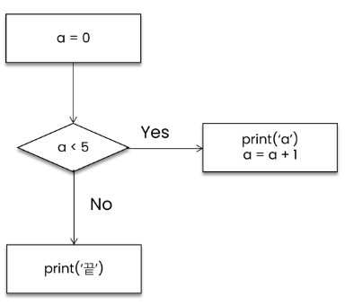
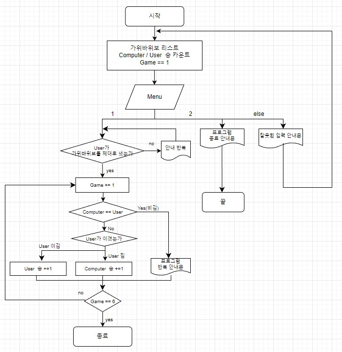

# 제어문(Control Statement)

- 순차, 선택, 반복
- 파이썬은 기본적으로 위에서부터 아래로 차례대로 명령을 수행
- 특정 상황에 따라 코드를 선택적으로 실행(분기/조건)하거나 계속하여 실행(반복)하는 제어가 필요함
- [참고] 코드 스타일 가이드(python)
    - 들여쓰기 시 space키 4번 혹은 Tab키 1번을 입력하되, 한 코드 안에서는 반드시 한 종류의 들여쓰기를 사용
    - 원칙적으로는 공백 사용을 권장(PEP8)
    
        [PEP 8 - Style Guide for Python Code](https://peps.python.org/pep-0008/)
    
- 제어문은 크게 조건문과 반복문으로 나눌 수 있음
  
</br>

## 조건문(Conditional Statement)

- 참/거짓을 판단할 수 있는 조건식과 함께 사용
- 여러 개의 `elif` 부가 있을 수 있고(없거나), `else`는 선택적으로 사용
- 들여쓰기 유의
- [실습] 변수 num 값의 홀수/짝수 여부 출력
    
    ```python
    num = int(input('숫자 입력: '))
    if num % 2:
    	print('홀수입니다.')
    else:
    	print('짝수입니다.')
    ```
    
- 조건 표현식(Conditional Expression)
    - 조건 표현식은 일반적으로 조건에 따라 값을 정할 때 활용
    - **삼항 연산자(Ternary Operator)**로 부르기도 함
    - **“간단한 조건문일 때”** 한 줄로 처리하는 것이지, 한 줄로 표현한다고 해서 속도가 더 빨라지는 것은 아님
        
        ```python
        # true_value if <조건식> else false_value
        
        # 절댓값을 저장하기 위한 코드 작성해보기
        value = num if num >=0 else -num
        
        # 홀짝수 판별 코드 작성해보기
        result = '홀수입니다' if num % 2 else '짝수입니다'
        print(result)
        
        # 양수 또는 0 출력하기
        num = -5
        value = num if num >=0 else 0
        print(value) # 0
        ```
        
- 중첩 조건문(Nested Conditional Statement)
    
    ```python
    dust = 500
    if dust > 150:
    	print('매우 나쁨')
    	if dust > 300:
    		print('실외 활동을 자제하세요.')
    elif dust > 80:
    	print('나쁨')
    elif dust > 30:
    	print('보통')
    elif dust >= 0:
    	print('좋음')
    else:
    	print('값이 잘못되었습니다.')
    
    '''
    매우나쁨
    실외 활동을 자제하세요.
    '''
    ```
    
</br>

## 반복문(Loop Statement)

- 특정 조건을 만족할 때까지 같은 동작을 계속 반복하고 싶을 때 사용
- for문과 while문이 있으며 for문으로 표현할 수 있는 것은 while문으로도 표현가능하며, 반대의 경우도 동일
- 다만 for문은 **“반복 횟수를 알고 있을 때”,** while문은 **“조건이 존재할 때”** 용이함
    - for문은 반복가능한 객체를 모두 순회하면 종료(별도의 종료 조건이 필요 없음)되는 반면, while문은 종료 조건에 해당하는 코드를 통해 반복문을 종료시켜야 함**(반드시 종료조건 설정해야 함)**
    - 반복문 제어
        - break: 반복문 종료
            
            ```python
            n = 0
            while True:
            	if n == 3:
            		break
            	print(n)
            	n += 1
            
            '''
            0
            1
            2
            '''
            ```
            
        - **continue: continue 이후의 코드 블록은 수행하지 않고, “다음 반복”을 수행**
        - for-else: 끝까지 반복문을 실행한 이후에  else문 실행되며, break를 통해 중간에 종료되는 경우 else문은 실행되지 않음
            
            ```python
            for char in 'apple':
            	if char == 'b':
            		print('b!')
            		break
            else:
            	print('b가 없습니다.')	
            ```
            
        - **pass: “아무것도 하지 않음”(문법적으로 필요하지만, 할 일이 없을 때 사용)**
            
            ```python
            for i in range(4):
            	if i ==2:
            		pass
            	print(i)
            
            '''
            0
            1
            2
            3
            '''
            
            for i in range(4):
            	if i ==2:
            		continue
            	print(i)
            
            '''
            0
            1
            3
            '''
            ```
            
- while문
    - 조건식이 참인 경우 반복적으로 코드를 실행
        - 코드 블록이 모두 실행되고, 다시 조건식을 검사하며 반복적으로 실행됨
        - 무한 루프를 하지 않도록 종료 조건이 반드시 필요
            
            ```python
            while <조건식>:
            	<코드 블럭>
            
            while True:
            	print('조건식이 참일 때까지')
            	print('계속 반복')
            ```
            
            
            
            ```python
            a=0
            while a<5:
            	print(a)
            	a += 1 # 복합 연산자(In-Place Operator, 연산과 할당을 합쳐 놓은 것)
            print('끝')
            ```
            
- for문
    - 시퀀스(string, tuple, list, range)를 포함한 순회가능한 객체(iterable)의 요소를 모두 순회
        - for 변수명 in iterable
        - 문자열(string) 순회
            
            ```python
            # 한 글자씩 출력
            chars = input()
            for char in chars:
            	print(char)
            
            # 인덱스를 활용하는 방법
            for idx in range(len(chars)):
            	print(chars[idx])
            ```
            
        - 딕셔너리(dictionary) 순회: 기본적으로 key를 순회하며, key를 통해 값을 활용
            
            ```python
            # key 활용
            grades = ('john':80, 'eric':90}
            for student in grades:
            	print(student, grades[student])
            
            '''
            john 80
            eric 90
            '''
            
            # '.items()' 활용
            for student, grade in grades.items():
            	print(student, grade)
            ```
            
        - enumerate 순회
            - 인덱스와 객체를 쌍으로 담은 열거형(enumerate) 객체 반환
            - (index, value)형태의 tuple로 구성된 열거 객체를 반환
                
                ```python
                members = ['민수', '영희', '철수']
                for idx, member in enumerate(members):
                	print(idx, number)
                
                '''
                0 민수
                1 영희
                2 철수
                '''
                
                enumerate(members) # enumerate at 0x105d3e100
                print(list(enumerate(members)) # [(0, '민수'), (1, '영희'), (2, '철수')]
                print(list(enumerate(members, start=1))) # [(1, '민수'), (2, '영희'), (3, '철수')]
                ```
                
    - List comprehension
        - 표현식과 제어문을 통해 **“특정한 값을 가진”** 리스트를 간결하게 생성하는 방법
        - 여러 줄의 코드를 한 줄로 줄일 수 있으나, 반드시 권장되는 것은 아님
            
            ```python
            # [expression for 변수 in iterable]
            # [expression for 변수 in iterable if 조건식]
            
            # 1~3의 세제곱 리스트 만들기
            cubic_list = []
            for number in range(1, 4):
            	cubic_list.append(number**3)
            print(cubic_list) # [1, 8, 27]
            
            cubic_list = [number **3 for number in range(1, 4)]
            print(cubic_list) # [1, 8, 27]
            ```
            
    - Dictionary Comprehension
        - 표현식과 제어문을 통해 **“특정한 값을 가진”** 딕셔너리를 간결하게 생성하는 방법
            
            ```python
            # {key: value for 요소 in iterable}
            
            # 1~3의 세제곱 리스트 만들기
            cubic_dict = {}
            for number in range(1, 4):
            	cubic_dict[number] = number ** 3
            print(cubic_dict) # {1: 1, 2: 8, 3: 27}
            
            cubic_dict = {number: number **3 for number in range(1, 4)}
            print(cubic_dict) # {1: 1, 2: 8, 3: 27}
            ```
            

</br>

# [실습] 가위바위보 게임 만들기

- 알고리즘 순서도 그리기
    
    
    

    참조 : [Diagram Software and Flowchart Maker](https://www.diagrams.net/)
