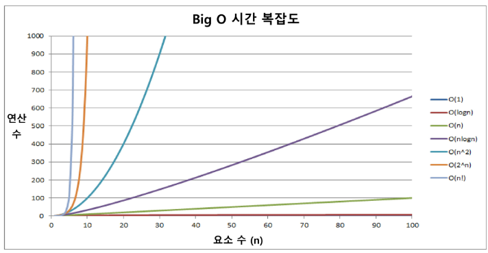

# 알고리즘

- 유한한 단계를 통해 문제를 해결하기 위한 절차나 방법
- 컴퓨터 분야에서 알고리즘을 표현하는 방법
    - 의사코드(Pseudocode) - 추천
    - 순서도
- 무엇이 좋은 알고리즘인가?
    - 정확성 : 얼마나 정확하게 동작하는가
    - 작업량 : 얼마나 적은 연산으로 원하는 결과를 얻어내는가
        - 알고리즘의 작업량을 표현할 때 시간복잡도(Time Complexity)로 표현
        - 실제 걸리는 시간을 측정, 실행되는 명령문의 개수를 계산
        - 빅-오(O) 표기법(Big-Oh Notation)
            
            
            
    - 메모리 사용량 : 얼마나 적은 메모리를 사용하는가
    - 단순성 : 얼마나 단순한가
    - 최적성 : 더 이상 개선할 여지 없이 최적화되었는가

# 배열

- 일정한 자료형의 변수들을 하나의 이름으로 열거하여 사용하는 자료구조

# 정렬

- 종류
    - **버블정렬, 카운팅정렬, 선택정렬**, 퀵정렬, 삽입정렬, 병합정렬
    - 버블정렬
        - 인접한 두 개의 원소를 비교하며 자리를 계속 교환하는 방식
        - 정렬과정
            - 첫 번째 원소부터 인접한 원소끼리 계속 자리를 교환하면서 맨 마지막 자리까지 이동
            - 한 단계가 끝나면 가장 큰 원소가 마지막 자리로 정렬됨
            - 교환하며 자리를 이동하는 모습이 물 위에 올라오는 거품모양과 같다고 하여 버블정렬이라고 함
        - 시간 복잡도 : O(n^2)

- 버블정렬
    - 전체 범위 내에서 앞에서부터 요소 두 개씩 비교해 자리 바꾸고, 그 다음에는 끝에서 하나 뺀 범위 내에서 앞에서부터 요소 두 개씩 비교해 자리 바꾸고, 이후 또 하나 뺀 범위 내에서 동일한 절차 적용
        
        ```python
        5
        55 7 78 12 42
        for i : N-1 -> 1    #각 구간의 끝
            for j : 0 -> i-1    #비교할 왼쪽 원소
                if arr[j] > arr[j+1]:
                    arr[j] <-> arr[j+1]     #큰 원소 오른쪽으로
        '''
        N = int(input())
        arr = list(map(int, input().split()))
        for i in range(N-1, 0, -1): # 각 구간의 끝
            for j in range(i): # 비교할 왼쪽 원소
                if arr[j] < arr[j+1]:
                    arr[j], arr[j+1] = arr[j+1], arr[j] # 큰 원소 오른쪽으로
        
        print(*arr)
        ```
        
- 최댓값 구하기
    
    ```python
    T = int(input())
    for tc in range(1, T+1):
        N = int(input())
        arr = list(map(int, input().split()))
        maxV = arr[0]   # 첫 원소를 최대로 가정
        for i in range(1, N): # 나머지 원소와 비교
            if maxV < arr[i]:
                maxV = arr[i]
            print(f'#{tc} {maxV}')
    ```