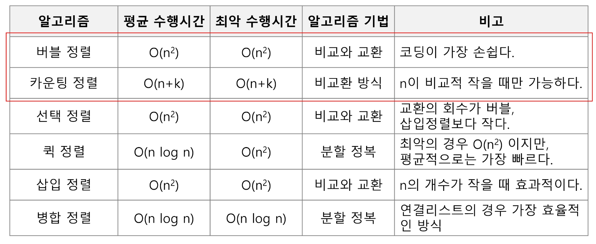

## 카운팅 정렬

- 항목들의 순서를 결정하기 위해 집합에 각 항목이 몇 개씩 있는지 세는 작업을 하여, 선형 시간에 정렬하는 효율적인 알고리즘
- 제한사항
    - 정수나 정수로 표현할 수 있는 자료에 대해서만 적용 가능
    - 카운트들을 위한 충분한 공간을 할당하려면 집합 내의 가장 큰 정수를 알아야 한다.
- 시간복잡도: O(n+k) : n은 리스트 길이, k는 정수의 최대값
    
    ```python
    def Counting_Sort(A,B,k)
    # A [] -- 입력 배열(0 to k)
    # B [] -- 정렬된 배열
    # C [] -- 카운트 배열
    
    	C = [0] * (k+1)
    	for i in range(0, len(A)):
    		C[A[i]] += 1
    	for i in range(1, len(C)):
    		C[i] += C[i-1]
    	for i in range(len(B)-1, -1, -1):
    		C[A[i]] -= 1
    		B[C[A[i]]] = A[i]
    ```
    



## 탐욕 알고리즘

- 최적해를 구하는데 사용되는 근시안적인 방법
- 여러 경우 중 하나를 결정해야 할 때마다 그 순간에 최적이라고 생각되는 것을 선택해나가는 방식으로 진행하여 최종적인 해답에 도달한다.
- 각 선택의 시점에서 이루어지는 결정은 지역적으로는 최적이지만, 그 선택들을 계속 수집하여 최종적인 해답을 만들었다고 하여, 그것이 최적이라는 보장은 없다.
- 일반적으로 머릿속에 떠오르는 생각을 검증 없이 바로 구현하면 Greedy 알고리즘이 된다.

- 동작과정
    - 해 선택: 현재 상태에서 부분문제의 최적해를 구한 뒤, 이를 부분 해 집합에 추가한다.
    - 실행 가능성 검사: 새로운 부분해집합이 실행가능한지 확인한다. 곧, 문제의 제약조건을 위반하지 않는지를 검사한다.
    - 해 검사: 새로운 부분해 집합이 문제의 해가 되는지를 확인한다. 아직 전체 문제의 해가 완성되지 않았다면 1)의 해 선택부터 다시 시작한다.

- 예시
    - Baby-gin
        
        ```python
        num = 456789
        c = [0] *12
        for i in range(6):
        	c[num%10] += 1
        	num //= 10
        
        # [0][0][0][0][1][1][1][1][1][1][0][0][0]
        
        i = 0
        tri = run = 0
        while i < 10:
        	if c[i] >= 3 : # triplete 조사 후 데이터 삭제
        		c[i] -= 3
        		tri += 1
        		continue;
        	if c[i] >= 1 and c[i+1] >=1 and c[i+2] >=1 : # run 조사 후 데이터 삭제
        		c[i] -= 1
        		c[i+1] -= 1
        		c[i+2] -= 1
        		run += 1
        		continue
        	i += 1
        
        if run + tri == 2 : print('Baby Gin')
        else: print('Lose')
        ```