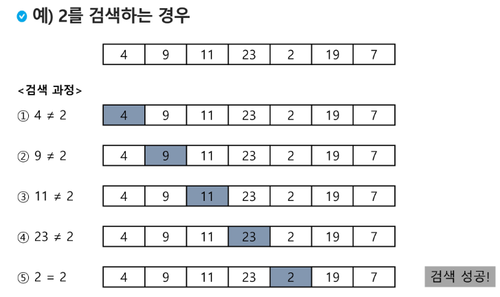
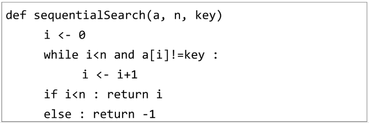
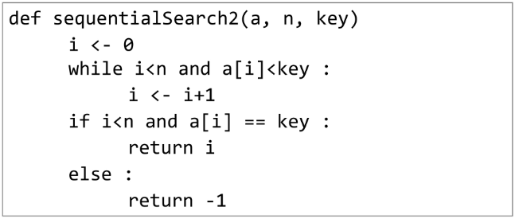

# 검색(Search)

- 저장되어 있는 자료 중에서 원하는 항목을 찾는 작업
- 목적하는 탐색 키를 가진 항목을 찾는 것
    - 탐색 키(search key): 자료를 구별하여 인식할 수 있는 키
- 검색의 종류
    - 순차 검색(sequential search)
    - 이진 검색(binary search)
    - 해쉬(hash)
 
</br>

## 순차 검색(Sequential Search)

- 일렬로 되어 있는 자료를 순서대로 검색하는 방법
    - 가장 간단하고 직관적인 검색방법
    - 배열이나 연결리스트 등 순차구조로 구현된 자료구조에서 원하는 항목을 찾을 때 유용함
    - 알고리즘이 단순하여 구현이 쉽지만, 검색 대상의 수가 많은 경우 수행시간이 급격히 증가하여 비효율적임
- 2가지 경우
    - 정렬되어 있지 않은 경우
    - 정렬되어 있는 경우
- 검색 과정
    - 첫 번째 원소부터 순서대로 검색대상과 키 값이 같은 원소가 있는지 비교하며 찾는다.
    - 키 값이 동일한 원소를 찾으면 그 원소의 인덱스를 반환한다.
    - 자료구조의 마지막에 이를 때까지 검색 대상을 찾지 못하면 검색 실패

        

- 정렬되어 있지 않은 경우
    - 첫 번째 원소를 찾을 때는 1번 비교, 두 번째 원소를 찾을 때는 2번 비교…
    - 정렬되지 않은 자료에서의 순차 검색의 평균 비교횟수
        - (1/n)*(1+2+3+ … +n) = (n+1)
    - 시간 복잡도 : O(n)



- 정렬되어 있는 경우
    - 자료가 오름차순으로 정렬된 상태에서 검색을 실시한다고 가정하자.
    - 자료를 순차적으로 검색하면서 키 값을 비교하여, 원소의 키 값이 검색 대상의 키 값보다 크면 찾는 원소가 없다는 것이므로 더 이상 검색하지 않고 검색을 종료한다.
    - 찾고자 하는 원소의 순서에 따라 비교횟수가 결정됨
        - 정렬이 되어있으므로, 검색 실패를 반환하는 경우 평균 비교횟수가 반으로 줄어든다.
        - 시간 복잡도: O(n)
            
            
            
 
</br>

## 이진 검색(Binary Search)

- 자료의 가운데에 있는 항목의 키 값과 비교하여 다음 검색의 위치를 결정하고 검색을 계속 진행하는 방법
    - 목적 키를 찾을 때까지 이진 검색을 순환적으로 반복 수행함으로써 검색범위를 반으로 줄여가면서 보다 빠르게 검색을 수행함
- 이진 검색을 하기 위해서는 자료가 정렬된 상태여야 한다.
- 검색 과정
    - 자료의 중앙에 있는 원소를 고른다.
    - 중앙 원소의 값과 찾고자 하는 목표 값을 비교한다.
    - 목표 값이 중앙 원소의 값보다 작으면 자료의 왼쪽 반에 대해서 새로 검색을 수행하고, 크다면 자료의 오른쪽 반에 대해서 새로 검색을 수행한다.
    - 찾고자 하는 값을 찾을 때까지 위의 과정을 반복한다.
- 구현
    - 검색 범위의 시작점과 종료점을 이용하여 검색을 반복 수행한다.
    - 이진 검색의 경우, 자료에 삽입이나 삭제가 발생했을 때 배열의 상태를 항상 정렬상태로 유지하는 추가 작업이 필요하다.
- 코드 (중요중요)
    
    ```python
    # 기본 코드
    def binarySearch(a, N, key):
        start = 0
        end = N-1
        while start <= end:
            middle = (start + end)//2
            if a[middle] == key: # 검색 성공
                return True
            elif a[middle] > key:
                end = middle - 1
            else:
                start = middle + 1
        return False # 검색 실패
    
    # 재귀함수 활용
    # 그러나 반복구조가 훨씬 빠르므로 연습용으로만 보자.
    def binarySearch2(a, low, high, key):
        if low > high: # 검색 실패
            return False
        else:
            middle = (low + high)//2
            if key == a[middle]: # 검색 성공
                return True
            elif key < a[middle]:
                return binarySearch(a, low, middle-1, key)
            elif a[middle] < key:
                return binarySearch(a, middle+1, high, key)
    ```
    
</br>

## 선택 정렬(Selection Sort)

- 주어진 자료들 중 가장 작은 값의 원소부터 차례대로(오름차순) 선택하여 위치를 교환하는 방식
    - 앞서 살펴본 셀렉션 알고리즘을 전체 자료에 적용한 것
- 정렬 과정
    - 주어진 리스트 중에서 최솟값을 찾는다.
    - 그 값을 리스트의 맨 앞에 위치한 값과 교환한다.
    - 맨 처음 위치를 제외한 나머지 리스트를 대상으로 위의 과정을 반복한다.
    - 미정렬원소가 하나 남은 상황에서는 마지막 원소가 가장 큰 값을 갖게 되므로, 실행을 종료하고 선택 정렬이 완료된다.
- 시간 복잡도
    - O(n^2)
- 구현
    
    ```python
    def selectionSort(a, N):
        for i in range(N-1): # 마지막 한 원소만 그냥 반환
            minIdx = i
            for j in range(i+1, N):
                if a[minIdx] > a[j]:
                    minIdx = j
            a[i], a[minIdx] = a[minIdx], a[i]
    ```
    

- 이진검색, 선택정렬,  거품정렬은 원리, 의사코드, 실제코드를 정확히 알 수 있도록 연습하자!
 
</br>

## 선택 알고리즘(Selection Algorithm)

- 저장되어 있는 자료로부터 k번째로 큰 혹은 작은 원소를 찾는 방법을 선택 알고리즘이라 한다.
    - 최솟값, 최댓값 혹은 중간값을 찾는 알고리즘을 의미하기도 함
- 선택과정
    - 정렬 알고리즘을 이용해 자료 정리
    - 원하는 순서에 있는 원소 가져오기
- 구현
    
    ```python
    N = int(input())
    arr = list(map(int, input().split()))
    for i in range(N-1):    #  작업 구간의 시작인덱스
        minIdx = i          # 맨 앞이 최소라 가정
        for j in range(i+1, N):
            if arr[minIdx] > arr[j]:
                minIdx = j
        arr[i], arr[minIdx] = arr[minIdx], arr[i]
    print(arr)
    ```
    
- 예시: k번째로 작은 원소를 찾는 알고리즘
    - 1번째부터 k번째까지 작은 원소를 찾는 알고리즘
        - 1번부터 k번째까지 작은 원소들을 찾아 배열의 앞쪽으로 이동시키고, 배열의 k번째를 반환한다.
        - k가 비교적 양호하며, O(kn) 수행시간을 필요로 한다.
            
            ```python
            def select(arr, k):
                for i in range(0, k):
                    minIndex = i
                    for j in range(i+1, len(arr)):
                        if arr[minIndex] > arr[j]:
                            minIndex = j
                    arr[i], arr[minIndex] = arr[minIndex], arr[i]
                return arr[k-1]
            ```
             
</br>


## 실습 팁

- 파이참 `Alt` + `J` == VScode `Ctrl` + `D`

[Diffchecker - Compare text online to find the difference between two text files](https://www.diffchecker.com/)

- 리스트 만들 때 주의할 점

```python
# NxN 형태는 같지만
# 이렇게 만들면 안 됨 -- 주소값이 복사됨
N = 4
arr = [[0] * N] * N
for i in arr:
    print(id(i))

# 2081017366016
# 2081017366016
# 2081017366016
# 2081017366016

# 이렇게 만들어야 함!
arr2 = [[0] * N for _ in range(N)]
for i in arr2:
    print(id(i))
    
# 2081017309824
# 2081017307712
# 2081021987456
# 2081021987328
```