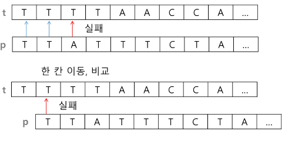
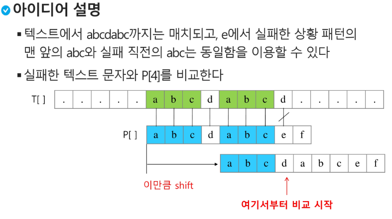
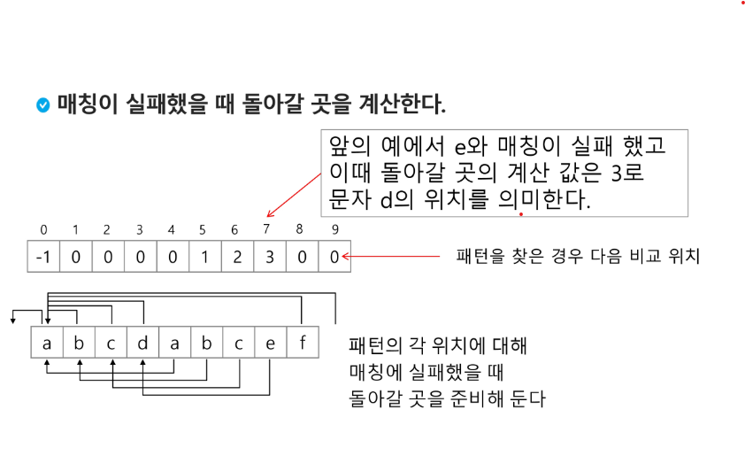
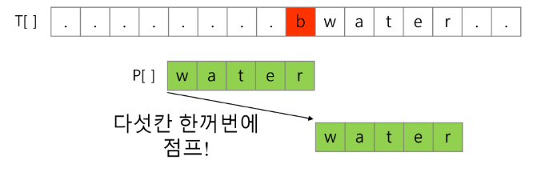
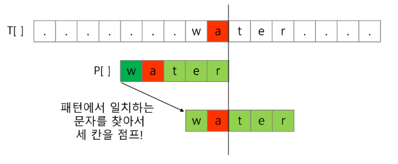
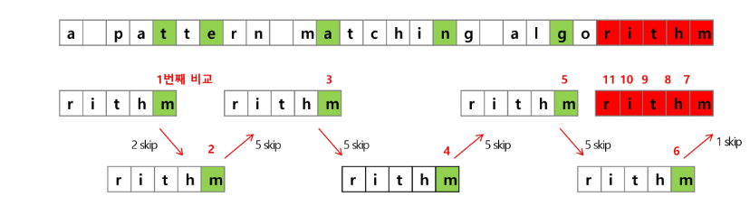

## 패턴 매칭

- 패턴매칭에 사용되는 알고리즘들
    - 고지식한 패턴검색 알고리즘(Brute Force)
    - 카프-라빈 알고리즘
    - KMP 알고리즘
    - 보이어-무어 알고리즘

</br>

- 고지식한 알고리즘(Brute Force)
    - 본문 문자열을 처음부터 끝까지 차례대로 순회하면서 패턴 내의 문자들을 일일이 비교하는 방식
        
        
        
    - 코드
        
        ```python
        p = 'is' # 찾을 패턴
        t = 'This is a book!' # 전체 텍스트
        M = len(p) # 찾을 패턴의 길이
        N = len(t) # 전체 텍스트의 길이
        
        # 방법 1 - while문 사용
        def BruteForce(p,t):
            i = 0 # t의 인덱스
            j = 0 # p의 인덱스
            while j < M and i < N:
                if t[i] != p[j]:
                    i = i - j # (이따 1 더해지면) 다시 처음부터 봐
                    j = -1 # (이따 1 더해지면) 처음으로 가
                i += 1 # 다음 문자 확인
                j += 1
            if j == M : return i - M # 검색 성공 후 찾은 패턴의 시작인덱스 반환
            else: return -1 # 검색 실패
            
        # 방법 2    
        ''' 
            While문 안의 if문을 이렇게 바꿔쓸 수도 있음
                if t[i] == p[j]:
                    i += 1
                    j += 1
                else:
                    i = i - j + 1
                    j = 0
        '''
        
        # 방법 3 - for문 사용
        def bf2(p, t, lenoft, lenofp):
            for i in range(N-M+1):
                for j in range(M):
                    if t[i+j] != p[j]:
                        break
                else:
                    return i
            return -1
        print(bf2(p, t, N, M))
        
        # cnt 찾기
        p = 'ab' # 찾을 패턴
        t = 'aababa' # 전체 문장
        M = len(p)
        N = len(t)
        
        def bf2(p, t, lenoft, lenofp):
            cnt = 0
            for i in range(N-M+1):
                for j in range(M):
                    if t[i+j] != p[j]:
                        break # break 걸리면 다음 번 i로 감 
                else: # 앞에서 break 안걸릴 때만 여기로 옴
                    cnt += 1
            return cnt
        print(bf2(p, t, N, M))
        # for ~ else문 : 반복문 도중 break 되지 않고 끝까지 반복되었을 때 else문 실행
        ```
        
    - 고지식한 패턴 검색 알고리즘의 시간복잡도
        - 최악의 경우 시간복잡도는 텍스트의 모든 위치에서 패턴을 비교해야 하므로 O(MN)이 됨
        - 비교횟수를 줄일 수 있는 방법이 없을까?

</br>

- KMP 알고리즘
    - 불일치가 발생한 텍스트 스트링의 앞 부분에 어떤 문자가 있는지를 미리 알고 있으므로, 불일치가 발생한 앞부분에 대하여 다시 비교하지 않고 매칭을 수행
    - 패턴을 전처리하여 배열 next[M]을 구해서 잘못된 시작을 최소화함
        - next[M]: 불일치가 발생했을 경우 이동할 다음 위치
    - 시간 복잡도: O(M+N)
        
        
        
        
        

</br>

- 보이어- 무어 알고리즘
    - 오른쪽에서 왼쪽으로 비교
    - 대부분의 상용 소프트웨어에서 채택하고 있는 알고리즘
    - 패턴에 오른쪽 끝에 있는 문자가 불일치하고 이 문자가 패턴 내에 존재하지 않는 경우, 이동 거리는 무려 패턴의 길이만큼이 됨
        
        
        
    - 오른쪽 끝에 있는 문자가 불일치하고 이 문자가 패턴 내에 존재할 경우
        
        
        
    - 보이어-무어 알고리즘을 이용한 예시
        
        
        
    - 특징
        - 텍스트 문자를 다 보지 않아도 된다.
            - 앞의 두 알고리즘들은 텍스트 문자열의 문자를 적어도 한번씩 훑는 반면, (따라서 최선의 경우에도 Ω(n)임) 보이어-무어 알고리즘은 텍스트 문자를 다 보지 않아도 됨
        - 발상의 전환: 패턴의 오른쪽부터 비교한다.
        - 최악의 경우 수행시간: Θ(mn)
        - 입력에 따라 다르지만 일반적으로 Θ(n)보다 시간이 덜 든다.

</br>

- 문자열 매칭 알고리즘 비교
    - 찾고자 하는 문자열 패턴의 길이 m, 총 문자열 길이 n
    - 고지식한 패턴 검색 알고리즘: O(mn) — 최대
    - 카프-라빈 알고리즘:  Θ(n) — 평균
    - KMP 알고리즘:  Θ(n)