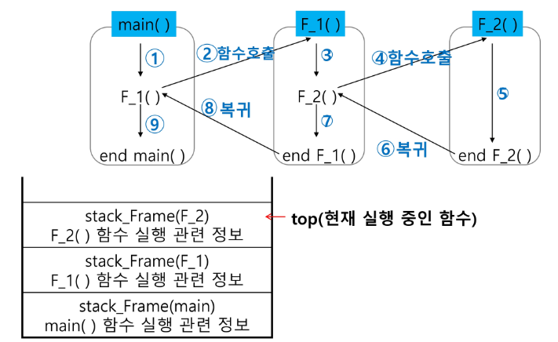
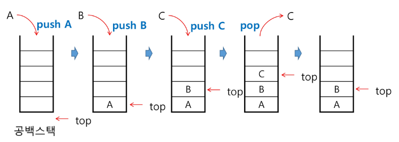

# 스택 1

## 스택

- 스택의 특성
    - 물건을 쌓아올리듯 자료를 쌓아 올린 형태의 자료구조
    - 스택에 저장된 자료는 선형구조를 가짐
        - 선형구조: 자료간의 관계가 1대1의 관계
        - 비선형구조: 자료간의 관계가 1대N의 관계(예:트리)
    - 스택에 자료를 삽입하거나 스택에서 자료를 꺼낼 수 있음
    - `후입선출(LIFO, Last-In-First-Out)` 즉 마지막에 삽입한 자료를 가장 먼저 꺼낸다.
        - 예를 들어 스택에 1, 2, 3 순으로 자료를 삽입한 후 꺼내면 역순으로 즉 3, 2, 1 순으로 꺼낼 수 있음

- 스택을 프로그램에서 구현하기 위해 필요한 자료구조와 연산
    - 자료구조: 자료를 선형으로 저장할 저장소
        - 배열을 사용할 수 있음
        - 저장소 자체를 스택이라 부르기도 함
        - 스택에서 마지막 삽입된 원소의 위치를 `top`이라 부름
    - 연산
        - 삽입: 저장소에 자료를 저장한다. 보통 `push`라고 함
        - 삭제: 저장소에서 자료를 꺼낸다. 꺼낸 자료는 삽입한 자료의 역순으로 꺼냄. 보통 `pop`이라 함.
        - 스택이 공백인지 아닌지를 확인하는 연산. `isEmpty`
        - 스택의 top에 있는 item(원소)을 반환하는 연산. `peek`



- 스택의 구현
    
    ```python
    # push 알고리즘
    def push(item):
        s.append(item)
    
    def push(item, size):
        global top
        top += 1
        if top == size:
            print('overflow!')
        else:
            stack[top] = item
    
    size = 10
    stack = [0]*size
    top = -1
    
    push(10, size)
    top += 1
    stack[top] = 20
    ```
    
    ```python
    # pop 알고리즘
    def pop():
        global top
        if top == -1:
            print('underflow')
            return 0
        else:
            top -= 1
            return stack[top+1]
    
    print(pop())
    
    if top > -1:    # pop()
        top -= 1
        print(stack[top+1])
    ```
    
    ```python
    stack = [0]*3 # 크기가 정해진 스택 만들어놓고 써보자!
    top = -1
    
    top += 1
    stack[top] = 10
    
    top += 1
    stack[top] = 20
    
    if top > -1:
        top += 1 # push(30)
        stack[top] = 30
    
    if top > -1:
        top -= 1
        print(stack[top+1])
    
    if top > -1:
        top -= 1
        print(stack[top+1])
    
    if top > -1:
        top -= 1
        print(stack[top+1])
    
    ```
    
    - 스택 구현 시 고려 사항
        - 1차원 배열을 사용하여 구현할 경우 구현이 용이하다는 장점이 있지만 스택의 크기를 변경하기 어렵다는 단점
        - 이를 해결하기 위한 방법으로 저장소를 동적으로 할당하여 스택을 구현하는 방법이 있음. 동적 연결리스트를 이용하여 구현하는 방법을 의미함. 구현이 복잡하다는 단점이 있지만 메모리를 효율적으로 사용한다는 장점.

- 스택의 응용
    - 스택을 이용한 괄호 검사
        - ()) : 비었으면 오류
        - (() : 스택이 비어있지 않으면 오류
    - 함수 호출(Function call)
        
        
        
        - 프로그램에서의 함수 호출과 복귀에 따른 수행순서를 관리
            - 가장 마지막에 호출된 함수가 가장 먼저 실행을 완료하고 복귀하는 후입선출 구조이므로, 후입선출 구조의 스택을 이용하여 수행순서 관리
            - 함수 호출이 발생하면 호출한 함수 수행에 필요한 지역변수, 매개변수 및 수행 후 복귀할 주소 등의 정보를 스택 프레임(stack frame)에 저장하여 시스템 스택에 삽입
            - 함수의 실행이 끝나면 시스템 스택의 top원소를 삭제(pop)하면서 프레임에 저장되어 있던 복귀주소를 확인하고 복귀
            - 함수 호출과 복귀에 따라 이 과정을 반복하여 전체 프로그램 수행이 종료되면 시스템 스택은 공백스택이 됨

## 실습

```python

def push(item):
    s.append(item)

def pop():
    if len(s) == 0:
        return
    else:
        return s.pop()

T = int(input())
for tc in range(1, T+1):
    s = input()
    for x in s:
        if x == '(':
            push(x)
        else: # 닫는 괄호가 있으면
            if not isEmpty():
                pop()
            else:
                print('Error') # 닫는 괄호인데 스택이 비어있는 경우
                break
    else: # 더 이상 닫는 괄호가 없으면
        if not isEmpty(): # 더 이상 닫는 괄호가 없는데 스택에 열린 괄호가 남은 경우
            print('Error')
        else:
            print('정상')
```