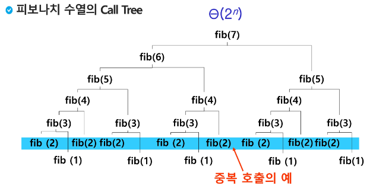

## 재귀 호출

- 자기 자신을 호출하여 순환수행되는 것
    - 어차피 메모리 영역이 구분되므로 서로 다른 함수가 호출되는 것과 마찬가지 원리임
- 함수에서 실행해야 하는 작업의 특성에 따라 일반적인 호출방식보다 재귀호출방식을 사용하여 함수를 만들면 프로그램의 크기를 줄이고 간단하게 작성
- 엄청난 중복 호출이 존재한다는 단점
    
    
    

- 실습코드1 - 리스트 복사 및 탐색
    
    ```python
    def f(i, k): # i: 복사할 인덱스, k: 배열의 크기
        if i == k:
            print(B)
        else:
            B[i] = A[i]
            f(i+1, k) # 다음 인덱스를 복사하러 이동
    
    A = [10, 20, 30]
    N = len(A)
    B = [0] * N
    f(0, N)
    ```
    
    ```python
    def f(i, k, key):
        if i == N: # 배열의 끝, 검색 실패
            return 0
        elif A[i] == key: # 성공
            return 1
        else:
            return f(i+1, k, key) # 다음 원소로 이동
    
    A = [7, 2, 5, 3, 8, 9]
    N = len(A)
    key = 3
    print(f(0, N, key)) # 1
    key = 6
    print(f(0, N, key)) # 0
    ```
    
- 실습코드2 - 부분집합 구하기
    
    ```python
    def f(i, k):
        if i == k:
            # print(bit)
            for j in range(k):
                if bit[j]:
                    print(A[j], end=' ') # 부분집합 구할때는 양갈래까지만 유의미
            print()
        else:
            bit[i] = 0
            f(i+1, k)
            bit[i] = 1 # 여기까지 양갈래
            f(i+1, k)
            # bit[i] = 2 # 여기까지 세갈래
            # f(i + 1, k)
        return
    A = [2, 3, 7, 9, 8]
    N = 4
    bit = [0]*N
    f(0, N)
    
    ''' print(bit) 한 경우
    [0, 0, 0, 0]
    [0, 0, 0, 1]
    [0, 0, 1, 0]
    [0, 0, 1, 1]
    [0, 1, 0, 0]
    [0, 1, 0, 1]
    [0, 1, 1, 0]
    [0, 1, 1, 1]
    [1, 0, 0, 0]
    [1, 0, 0, 1]
    [1, 0, 1, 0]
    [1, 0, 1, 1]
    [1, 1, 0, 0]
    [1, 1, 0, 1]
    [1, 1, 1, 0]
    [1, 1, 1, 1]
    '''
    
    '''
    9
    7
    7 9
    3
    3 9
    3 7
    3 7 9
    2
    2 9
    2 7
    2 7 9
    2 3
    2 3 9
    2 3 7
    2 3 7 9
    
    Process finished with exit code 0
    '''
    ```
    
</br>

## Memoization

- 메모이제이션(Memoization)은 컴퓨터 프로그램을 실행할 때 이전에 계산한 값을 메모리에 저장해서 매번 다시 계산하지 않도록 하여 전체적인 실행속도를 빠르게 하는 기술이다. 동적 계획법의 핵심이 되는 기술이다.
- 예컨대 피보나치 수를 구하는 알고리즘에서 fibo(n)의 값을 계산하자마자 저장하면(memoize), 실행시간을 Θ(n)으로 줄일 수 있다.
    
    ```python
    def fibo1(n):
        global memo
        if n>=2 and memo[n] == 0:
            memo[n] = (fibo1(n-1) + fibo1(n-2))
        return memo[n]
    
    memo = [0] * (n+1)
    memo[0] = 0
    memo[1] = 1
    ```
    
</br>

## DP(Dynamic Programming)

- 동적 계획 알고리즘은 그리디 알고리즘과 같이 `최적화 문제`를 해결하는 알고리즘이다.
- 동적 계획 알고리즘은 먼저 입력 크기가 작은 부분 문제들을 모두 해결한 후에 그 해들을 이용하여 보다 큰 크기의 부분 문제들을 해결하여, 최종적으로 원래 주어진 입력의 문제를 해결하는 알고리즘이다.
    
    ```python
    def fibo2(n):
        f = [0] * (n+1)
        f[0] = 0
        f[1] = 1
        for i in range(2, n+1):
            f[i] = f[i-1] + f[i-2]
    
        return f[n]
    ```
    

- DP의 구현방식
    - recursive 방식: fib1()
    - iterative 방식: fib2()
    - memoization을 재귀적 구조에 사용하는 것보다 반복적 구조로 DP를 구현한 것이 성능 면에서 보다 효율적이다.
    - 재귀적 구조는 내부에 시스템 호출 스택을 사용하는 오버헤드가 발생하기 때문이다.
        
        ```python
        def f(i,k): # i = 현재 위치, k = 목표치
            if i == k: # 목표에 도달하면
                print(B)
                return
            else:
                B[i] = A[i]
                f(i+1, k) # 다음 단계
        
        A = [10, 20, 30]
        B = [0] * 3
        f(0, 3) # [10, 20, 30]
        ```
        
</br>

## DFS(깊이우선탐색)

- 비선형구조인 그래프 구조는 **그래프로 표현된 모든 자료를 빠짐없이 검색**하는 것이 중요함
- 두 가지 방법
    - 깊이 우선 탐색(Depth First Search, DFS)
    - 너비 우선 탐색(Breadth First Search, BFS)
- 시작 정점의 한 방향으로 갈 수 있는 경로가 있는 곳까지 깊이 탐색해 가다가 더 이상 갈 곳이 없게 되면, 가장 마지막에 만났던 갈림길 간선(edge)이 있는 정점으로 되돌아와서—뒷걸음질친다— 다른 방향의 정점으로 탐색을 계속 반복하여 결국 모든 정점을 방문하는 순회방법
- 가장 마지막에 만났던 갈림길의 정점으로 되돌아가서 다시 깊이 우선 탐색을 반복해야 하므로 후입선출 구조의 스택 사용
- DFS 알고리즘의 원리
    
    1) 시작 정점 v를 결정하여 방문한다.
    
    2) 정점 v에 인접한 정점 중에서
    
    - 방문하지 않은 정점 w가 있으면, 정점 v를 스택에 push하고 정점 w를 방문한다. 그리고 w를 v로 하여 다시 2)를 반복한다.
    - 방문하지 않은 정점이 없으면, 탐색의 방향을 바꾸기 위해서 스택을 pop하여 받은 가장 마지막 방문 정점을 v로 하여 다시 2)를 반복한다.
    
    3) 스택이 공백이 될 때까지 2)를 반복한다.
    

```python
'''
7 8
1 2 1 3 2 4 2 5 4 6 5 6 6 7 3 7
'''
V, E = map(int, input().split())
arr = list(map(int, input().split()))
adjM = [[0]*(V+1) for _ in range(V+1)]
adjL = [[] for _ in range(V+1)]

for i in range(E):
    v1, v2 = arr[i*2], arr[i*2+1]
    adjM[v1][v2] = 1
    adjM[v2][v1] = 1

    adjL[v1].append(v2)
    adjL[v2].append(v1)

```

- SWEA 4871. 그래프 경로
    1. 인접행렬,  DFS 반복
    
    ```python
    def f1(S, G, N):            # S출발, G도착, N마지막 정점 그래프 탐색, DFS
        visited = [0] * (N + 1)     # 방문표시
        stack = []                  # 스택
        v = S
        while True:
            # print(v)                # v 방문
            if v == G:                  # 방문해서 목적지면
                return 1                # 성공 (1)
            visited[v] = 1
            for w in range(1, N+1):   # 인접하고 방문안한 w가 있으면
                if adjM[v][w] and visited[w] == 0:
                    stack.append(v)   # 현재 정점 push
                    v = w
                    break
            else:                       # 더이상 갈 곳이 없는 경우
                if stack:                   # pop
                    v = stack.pop()
                else:                   # 스택이 비어있으면
                    break
        # return visited[G]  # 탐색중에 G를 거쳐갔다면 visited[G] == 1
        return 0            # (1) v == G인지 검사한 경우
     
    T = int(input())
    for tc in range(1, T+1):
        V, E = map(int, input().split())
        adjM = [[0]*(V+1) for _ in range(V+1)]  # 인접행렬
        for _ in range(E):
            v, w = map(int, input().split())    # v출발, w 도착 (유향그래프)
            adjM[v][w] = 1                      # v에 인접한 w
            #adjM[w][v] = 1                      # 무향그래프였다면
        S, G = map(int, input().split())        # S 출발, G 도착
        print(f'#{tc} {f1(S, G, V)}')
    ```
    
    1. 인접리스트, DFS 반복
    
    ```python
    def f1(S, G, N):            # S출발, G도착, N마지막 정점 그래프 탐색, DFS
        visited = [0] * (N + 1)     # 방문표시
        stack = []                  # 스택
        v = S
        while True:
            # print(v)                # v 방문
            if v == G:                  # 방문해서 목적지면
                return 1                # 성공 (1)
            visited[v] = 1
            for w in adjL[v]:   # 인접하고 방문안한 w가 있으면
                if visited[w] == 0:
                    stack.append(v)   # 현재 정점 push
                    v = w
                    break
            else:                       # 더이상 갈 곳이 없는 경우
                if stack:                   # pop
                    v = stack.pop()
                else:                   # 스택이 비어있으면
                    break
        # return visited[G]  # 탐색중에 G를 거쳐갔다면 visited[G] == 1
        return 0            # (1) v == G인지 검사한 경우
     
    T = int(input())
    for tc in range(1, T+1):
        V, E = map(int, input().split())
        adjL = [[] for _ in range(V+1)]         # 인접 리스트
        for _ in range(E):
            v, w = map(int, input().split())    # v출발, w 도착 (유향그래프)
     
            adjL[v].append(w)
            # adjL[w].append(v)                 # 방향이 없는 경우
        S, G = map(int, input().split())        # S 출발, G 도착
        print(f'#{tc} {f1(S, G, V)}')
    ```
    
    1. 인접리스트, DFS 재귀
    
    ```python
    def f(v, G):            # S출발, G도착, N마지막 정점 그래프 탐색, DFS
        if v == G:
            return 1
        else:
            visited[v] = 1
            for w in adjL[v]:
                if visited[w] == 0:     # 인접하고 방문안한 w
                    if f(w, G):         # 목적지를 찾고 리턴하는 경우
                        return 1
            return 0
     
    T = int(input())
    for tc in range(1, T+1):
        V, E = map(int, input().split())
        adjL = [[] for _ in range(V+1)]         # 인접 리스트
        visited = [0] * (V+1)
        for _ in range(E):
            v, w = map(int, input().split())    # v출발, w 도착 (유향그래프)
     
            adjL[v].append(w)
            # adjL[w].append(v)                 # 방향이 없는 경우
        S, G = map(int, input().split())        # S 출발, G 도착
        print(f'#{tc} {f(S, G)}')
    ```
    
    1. 제출 답안 — top 사용
    
    ```python
    T = int(input())
    for tc in range(1, T+1):
        V, E = map(int, input().split())
        arr = [list(map(int,input().split())) for _ in range(E)]
        adjM = [[0]*(V+1) for _ in range(V+1)]
        S, G = map(int, input().split())
    
        for i in range(E):
            v1, v2 = arr[i][0], arr[i][1]
            adjM[v1][v2] = 1  # 유향 그래프
    
        # print(*adjM, sep='/n')
        stack = [0 for _ in range(V+1)]
        v = S # node
        visited = [0 for _ in range(V+1)] # visited
        top = -1
    
        while True: # while stack이라고 하면 계속 돌아감(위에서 선언)
            if v == G:
                print(f'#{tc}', 1)
                break
            visited[v] = 1 # 방문
            for w in range(1, V+1):
                if adjM[v][w] and visited[w] == 0: # 인접하고 방문안한 정점 w이 있으면
                    top += 1
                    stack[top] = v # 정점 v를 stack에 push하고
                    v = w # 방문
                    break
            else: # 모두 방문했거나 인접한 정점이 없으면 뒤로가기
                if top > -1:
                    top -= 1
                    v = stack[top+1]
                else:
                    print(f'#{tc}', 0)
                    break
    ```