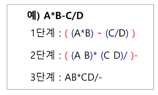
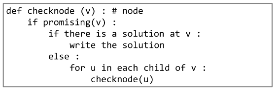

## 계산기 1

- 문자열로 된 계산식이 주어질 때, 스택을 이용하여 이 계산식의 값을 계산할 수 있다
- 문자열 수식 계산의 일반적 방법
    - step1. 중위표기법의 수식을 후위 표기법으로 변경(스택 이용)
    - step2. 후위표기법의 수식을 스택을 이용하여 계산
- 중위표기법(infix notation)
    - 연산자를 피연산자의 가운데 표기하는 방법(ex. A+B)
- 후위표기법(postfix notation)
    - 연산자를 피연산자 뒤에 표기하는 방법(ex. AB+)
- 중위표기법에서 후위표기법으로의 변환
    
    
    
    1. 입력받은 중위표기식에서 토크을 읽는다.
    2. 토큰이 피연산자이면 토큰 출력
    3. 토큰이 연산자(괄호포함)일 때, 이 토큰이 스택의 top에 저장되어 있는 연산자보다 우선순위가 높으면 스택에 push하고, 그렇지 않다면 스택 top의 연산자의 우선순위가 토큰의 우선순위보다 작을 때까지 스택에서 pop한 후 토큰의 연산자를 push한다. 만약 top에 연산자가 없으면 push한다.
    4. 토큰이 오른쪽 괄호 ‘)’이면 스택 top에 왼쪽 괄호 ‘(’가 올 때까지 스택에 pop 연산을 수행하고 pop한 연산자를 출력한다. 왼쪽 괄호를 만나면 pop만 하고 출력하지는 않는다.
    5. 중위 표기식에 더 읽을 것이 없다면 중지하고, 더 읽을 것이 있다면 1부터 다시 반복한다.
    6. 스택에 남아있는 연산자를 모두 pop하여 출력한다.

    </br>


    - 코드
        
        ```python
        '''
        2+3*4/5
        '''
        
        fn = list(input())
        
        stack = [0] * len(fn)
        top = -1
        postfix = ''
        op = {'*':2, '/':2, '+':1, '-':1}
        
        for t in fn:
            if '0'<=t<='9': #t not in op:         # 피연산자인 경우
                postfix += t
            elif t in op:                   # 연산자인 경우 (빈 칸등 무시)
                if top==-1 or op[stack[top]] < op[t]: # 스택이 비어있거나 토큰의 우선순위가 높으면
                    top += 1                            # push
                    stack[top] = t
                else:
                    while top > - 1 and op[stack[top]] >= op[t]:      # 스택에 남아있고 토큰의 우선순위가 높을 때 까지
                        top -= 1                                        # pop
                        postfix += stack[top+1]
                    top += 1  # push
                    stack[top] = t
        while top > -1:         # 스택에 연산자가 남아있으면
            top -= 1  # pop
            postfix += stack[top + 1]
        print(postfix)
        ```
        
- 후위표기법의 수식을 스택을 이용하여 계산
    1. 피연산자를 만나면 스택에 push한다.
    2. 연산자를 만나면 필요한 만큼의 피연산자를 스택에서 pop하여 연산하고, 연산결과를 다시 스택에 push한다.
    3. 수식이 끝나면, 마지막으로 스택에 pop하여 출력한다.

</br>

## 백트래킹

- 백트래킹(Backtracking) 기법은 해를 찾는 도중에 ‘막히면’ (즉, 해가 아니면) 되돌아가서 다시 해를 찾아가는 기법
    - 어떤 노드의 유망성을 점검한 후에 유망(promising)하지 않다고 결정되면 그 노드의 부모로 되돌아가(backtracking) 다음 자식 노드로 감
    - 어떤 노드를 방문했을 때 그 노드를 포함한 경로가 해답이 될 수 없으면 그 노드는 유망하지 않다고 하며, 반대로 해답의 가능성이 있으면 유망하다고 한다.
    - 가지치기(Pruning): 유망하지 않은 노드가 포함된 경로는 더 이상 고려하지 않음

</br>

- 백트래킹 기법은 최적화(optimization) 문제와 결정(decision) 문제를 해결할 수 있음
    - 결정 문제: 문제의 조건을 만족하는 해가 존재하는지 여부를 yes 또는 no로 답하는 문제
        - 미로 찾기, n-Queen 문제, Map coloring, 부분집합의 합 문제 등
        - 일단 냅다 이동해놓고 벽이 있다고 안가는게 아니라 , 갈림길이 있을 때 후보군을 모두 기록 → 되돌아올 때 후보군만 검토하면 됨.

</br>


- 백트래킹과 깊이우선탐색(DFS)과의 차이
    - 어떤 노드에서 출발하는 경로가 해결책으로 이어질 것 같지 않으면 더 이상 그 경로를 따라가지 않음으로써 시도횟수를 줄임(Pruning 가지치기)
    - DFS가 모든 경로를 추적하는 데 비해 백트래킹은 불필요한 경로를 조기에 차단
    - DFS를 가하기에는 경우의 수가 너무나 많음. 즉, N!가지 경우의 수를 가진 문제에 대해 DFS를 가하면 당연히 처리 불가능한 문제
    - 백트래킹 알고리즘을 적용하면 일반적으로 경우의 수가 줄어들지만 이 역시 최악의 경우에는 여전히 지수함수 시간(Exponential Time)을 요하므로 처리 불가능.

</br>

- 백트래킹 알고리즘
    1. 상태 공간 트리의 깊이우선 검색을 실시한다.
    2. 각 노드가 유망한지를 점검한다.
    3. 만일 그 노드가 유망하지 않으면, 그 노드의 부모 노드로 돌아가서 검색을 계속한다.



</br>


- 부분집합 구하기
1. 반복문 활용
    
    ```python
    bit = [0,0,0,0]
    for i in range(2):
        bit[0] = i
        for j in range(2):
            bit[1] = j
            for k in range(2):
                bit[2] = k
                for l in range(2):
                    bit[3] = l
                    print(bit)
    ```
    
2. 재귀함수 활용
    
    ```python
    def f(i, k):
        if i == k:
            print(bit)
        else:
            bit[i] = 1
            f(i+1, k) # 다음칸 이동
            bit[i] = 0
            f(i+1, k)
            # 이후 백트래킹 가지치기 단계 추가할 것임
    
    A = {1, 2, 3} # 부분집합 구하고 싶은 대상집합을 변경시키기 유리
    N = len(A)
    bit = [0]*N
    f(0, N)
    
    '''
    [1, 1, 1]
    [1, 1, 0]
    [1, 0, 1]
    [1, 0, 0]
    [0, 1, 1]
    [0, 1, 0]
    [0, 0, 1]
    [0, 0, 0]
    '''
    ```
    
3. 백트래킹
    
    ```python
    # powerset을 구하는 백트래킹 알고리즘
    MAXCANDIDATES = 2
    NMAX = 4
    a = [0] * NMAX
    
    def backtrack(a, k, input):
        global MAXCANDIDATES
        c = [0] * MAXCANDIDATES
    
        if k == input:
            print(a)
            # process_solution(a, k) # 답이면 원하는 작업을 한다
        else:
            k += 1
            ncandidates = construct_candidates(a, k, input, c)
            for i in range(ncandidates):
                a[k] = c[i]
                backtrack(a, k, input)
    
    def construct_candidates(a, k, input, c):
        c[0] = True
        c[1] = False
        return 2
    
    backtrack(a, 0, 3)
    
    '''
    [0, True, True, True]
    [0, True, True, False]
    [0, True, False, True]
    [0, True, False, False]
    [0, False, True, True]
    [0, False, True, False]
    [0, False, False, True]
    [0, False, False, False]
    '''
    ```

</br>

- 순열 생성
1. 반복문
        
        ```python
        for i1 in range(1, 4):
            for i2 in range(1, 4):
                if i2 != i1:
                    for i3 in range(1, 4):
                        if i3 != i1 and i3 != i2:
                            print(i1, i2, i3)
        ```
        
    
2. 백트래킹
    
    ```python
    # {1, 2, 3}을 포함하는 모든 순열을 생성하는 함수
    def backtrack(a, k, input):
        global MAXCANDIDATES
        c = [0] * MAXCANDIDATES
    
        if k == input:
            for i in range(1, k+1):
                print(a[i], end=' ')
            print()
        else:
            k += 1
            ncandidates = construct_candidates(a, k, input, c)
            for i in range(ncandidates):
                a[k] = c[i]
                backtrack(a, k, input)
    
    def construct_candidates(a, k, input, c):
        in_perm = [False] * NMAX # 앞에서 사용된 숫자 제외
    
        for i in range(1, k+1):
            in_perm[a[i]] = True # 앞에서 사용된 숫자들을 파악하고
    
        ncandidates = 0
        for i in range(1, input+1):
            if in_perm[i] == False: # 남은 숫자를
                c[ncandidates] = i # 후보로 추천
                ncandidates += 1
        return ncandidates
    
    NMAX = 11
    MAXCANDIDATES = 10
    a = [0] * NMAX
    backtrack(a, 0, 3)
    
    '''
    1 2 3 
    1 3 2 
    2 1 3 
    3 2 1 
    '''
    ```