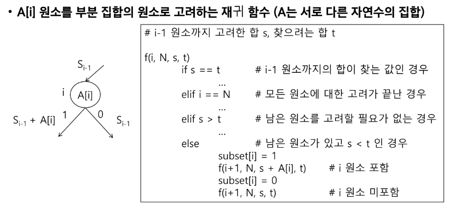
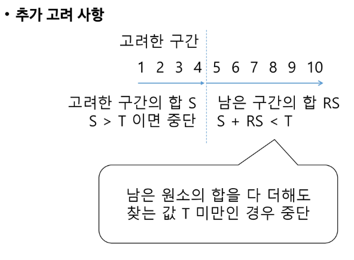
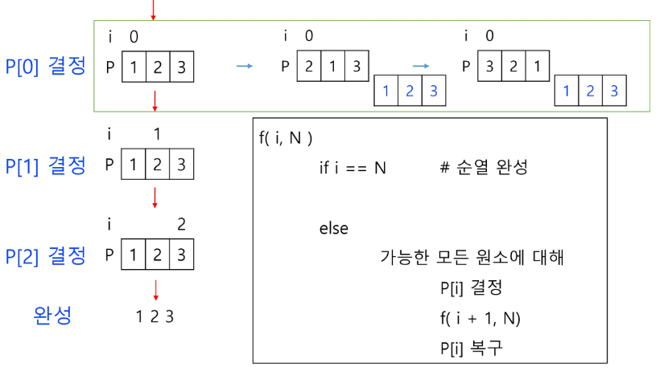
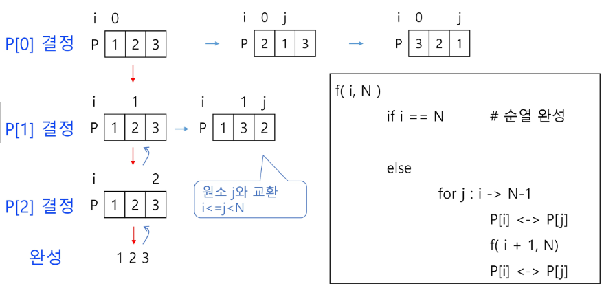
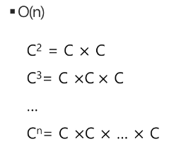
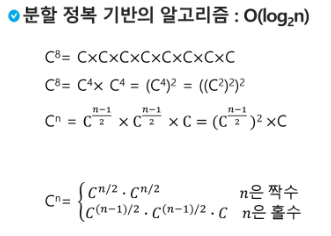

## 실습 코드1: 부분집합의 합

```python
def f(i,k, key):
    if i == k:
        s = 0
        for j in range(k):
            if bit[j]:
                # print(A[j], end = ' ') # 하나의 부분집합 완성
                s += A[j] # 부분집합의 합
        if s == key:
            return 1
        else:
            return 0
        # print()
        # print(bit, s)
        # if s == key: # 합이 key와 같은 부분집합을 출력
        #     for j in range(k):
        #         if bit[j]:
        #             print(A[j], end = ' ')
        #     print()

    else:
        bit[i] = 1
        f(i+1, k, key)
        bit[i] = 0
        f(i+1, k, key)

A = [1, 2, 3]
N = len(A)
bit = [0]*N
key = 10
f(0, N, key)
```

```python
def f(i,k, key):
    if i == k:
        s = 0
        for j in range(k):
            if bit[j]:
                # print(A[j], end = ' ') # 하나의 부분집합 완성
                s += A[j] # 부분집합의 합
        if s == key:
            return 1
        else:
            return 0
        # print()
        # print(bit, s)
        # if s == key: # 합이 key와 같은 부분집합을 출력
        #     for j in range(k):
        #         if bit[j]:
        #             print(A[j], end = ' ')
        #     print()

    else:
        bit[i] = 1
        if f(i+1, k, key):
            return 1
        bit[i] = 0
        if f(i+1, k, key):
            return 1
        return 0

A = [1, 2, 3, 4, 5, 6, 7, 8, 9, 10]
N = len(A)
bit = [0]*N
key = 10
print(f(0, N, key)) # 1
```

</br>

-  부분집합의 합(기본형)
```python
    def f(i, k, s, t): # i원소, k 집합의 크기, s i-1까지 고려된 원소의 합, t 목표
        if i == k:
            return
        else:
            f(i+1, k, s+A[i], t) # A[i] 포함
            f(i+1, k, s, t) # A[i] 미포함
```
    
```python
    def f(i, k, s, t): # i원소, k 집합의 크기, s i-1까지 고려된 원소의 합, t 목표
        global cnt
        if i == k:
            if s == t:
                cnt += 1
            return
        else:
            f(i+1, k, s+A[i], t) # A[i] 포함
            f(i+1, k, s, t) # A[i] 미포함
    
    A = [1, 2, 3, 4, 5, 6, 7, 8, 9, 10]
    N = len(A)
    key = 1
    cnt = 0
    bit = [0]*N
    
    f(0,N,0,key)
    print(cnt) # 합이 key인 부분집합의 수
```
```python
    # 부분집합의 합, 원소도 같이 나타내기
    
    def f(i, k, s, t): # i원소, k 집합의 크기, s i-1까지 고려된 원소의 합, t 목표
        global cnt
        if i == k:
            if s == t:
                for j in range(k):
                    if bit[j]:
                        print(A[j], end = ' ')
                print()
                cnt += 1
            return
        else:
            bit[i] = 1
            f(i+1, k, s+A[i], t) # A[i] 포함 -- 다음 번까지 합한 결과를 나한테 돌려줘
            bit[i] = 0
            f(i+1, k, s, t) # A[i] 미포함
    
    A = [1, 2, 3, 4, 5, 6, 7, 8, 9, 10]
    N = len(A)
    key = 10
    cnt = 0
    bit = [0]*N
    
    f(0,N,0,key)
    print(cnt) # 합이 key인 부분집합의 수
    # print()
```
    
```python
    # 호출횟수
    
    def f(i, k, s, t): # i원소, k 집합의 크기, s i-1까지 고려된 원소의 합, t 목표
        global cnt
        global fcnt
        fcnt += 1
        if i == k:
            if s == t:
                cnt += 1
                for j in range(k):
                    if bit[j]:
                        print(A[j], end = ' ')
                print()
            return
        else:
            bit[i] = 1
            f(i+1, k, s+A[i], t) # A[i] 포함 -- 다음 번까지 합한 결과를 나한테 돌려줘
            bit[i] = 0
            f(i+1, k, s, t) # A[i] 미포함
    
    A = [1, 2, 3, 4, 5, 6, 7, 8, 9, 10]
    N = len(A)
    key = 10
    cnt = 0
    bit = [0]*N
    fcnt = 0
    
    f(0,N,0,key)
    print(cnt) # 합이 key인 부분집합의 수
    print(fcnt) # 호출 횟수 # 2047
    # print()
```
    
```python
    def f(i, k, s, t): # i원소, k 집합의 크기, s i-1까지 고려된 원소의 합, t 목표
        global cnt
        global fcnt
        fcnt += 1
        if s > t: #  고려한 원소의 합이 찾는 합보다 큰 경우
            return
        if i == k:
            if s == t:
                cnt += 1
                # for j in range(k):
                #     if bit[j]:
                #         print(A[j], end = ' ')
                # print()
            return
        else:
            bit[i] = 1
            f(i+1, k, s+A[i], t) # A[i] 포함 -- 다음 번까지 합한 결과를 나한테 돌려줘
            bit[i] = 0
            f(i+1, k, s, t) # A[i] 미포함
    
    A = [1, 2, 3, 4, 5, 6, 7, 8, 9, 10]
    N = len(A)
    key = 10
    cnt = 0
    bit = [0]*N
    fcnt = 0
    
    f(0,N,0,key)
    print(cnt) # 합이 key인 부분집합의 수
    print(fcnt) # 415 -- 호출횟수가 줄었음
    # print()
```
    

- 백트래킹 활용
    

    
```python
    def f(i, k, s, t): # i원소, k 집합의 크기, s i-1까지 고려된 원소의 합, t 목표
        global cnt
        global fcnt
        fcnt += 1
        if s > t: #  고려한 원소의 합이 찾는 합보다 큰 경우
            return
        elif s == t: # 남은 원소를 고려할 필요가 없는 경우
            cnt += 1
            return
        elif i == k: # 모든 원소가 고려됨
            return
        else:
            bit[i] = 1
            f(i+1, k, s+A[i], t) # A[i] 포함
            bit[i] = 0
            f(i+1, k, s, t) # A[i] 미포함
    
    N = 10
    A = [i for i in range(1, N+1)]
    key = 55
    cnt = 0
    bit = [0]*N
    fcnt = 0
    
    f(0,N,0,key)
    print(cnt) # 1
    print(fcnt) # 2047
    # print()
    # key = 55 인 경우 1~ 10 다 더해야만 하므로 백트래킹 한 거나 DFS한 거나 구별이 없음
```
    

- 추가 고려 사항
    
    
    
    전체 합을 처음에 구해놓고 진행
    

## 실습코드 2: 순열

- [참고] 순열
    
    
    
    
    
```python
    def f(i, k):
        if i == k:
            print(p)
        else:
            for j in range(i, k): # 자리가 여러 개거나 갈림길이 여러 개인 경우 # i 자리부터 오른쪽 숫자들하고만 비교
                p[i], p[j] = p[j], p[i] # 자리바꿔 (i==j인 경우 그 숫자로 확정)
                # p[i] 결정, p[i]와 관련된 작업 가능
                f(i+1, k)
                p[i], p[j] = p[j], p[i] # 원래대로 돌려놔
    
    p = [1, 2, 3]
    N = len(p)
    f(0, N)
    
    '''
    [1, 2, 3]
    [1, 3, 2]
    [2, 1, 3]
    [2, 3, 1]
    [3, 2, 1]
    [3, 1, 2]
    '''
```
    

## 분할 정복 알고리즘

- 예제: 거듭제곱(Exponentiation)
    
    
    
```python
    def Power(Base, Exponent):
        if Base == 0:
            return 1 
        result = 1 # Base^0은 1이므로
        for i in range(Exponent):
            result *= Base
        return result
```
    
    
    
```python
    def Power(Base, Exponent):
        if Exponent == 0 or Base = 0:
            return 1
        if Exponent % 2 == 0:
            NewBase = Power(Base, Exponent/2)
            return NewBase * NewBase
        else:
            NewBase = Power(Base, (Exponent-1)/2)
            return (NewBase * NewBase) * Base
```
    

## 퀵 정렬

- 주어진 배열을 두 개로 분할하고, 각각을 정렬한다
    - 합병정렬과 동일?
    - 퀵 정렬 수행과정
    
```python
    def quickSort(a, begin, end):
        if begin < end:
            p = partition(a, begin, end)
            quickSort(a, begin, p-1)
            quickSort(a, p+1, end)
    
    def partition(a, begin, end):
        pivot = (begin + end)//2
        L = begin
        R = end
        while L < R:
            while(L<R and a[L]<a[pivot]) : L += 1 # 크거나 같은 거 찾을때까지 오른쪽으로
            while(L<R and a[R]>=a[pivot]) : R -= 1 # 작은 거 찾을때까지 왼쪽으로
            if L < R:
                if L == pivot : pivot = R
                a[L], a[R] = a[R], a[L]
        a[pivot], a[R] = a[R], a[pivot]
        return R
```
    
- 다른점1: 합병정렬은 그냥 두 부분으로 나누는 반면에, 퀵정렬은 분할할 때 기준 아이템(pivot item)을 중심으로 이보다 작은 것은 왼편, 큰 것은 오른편에 위치시킨다.
- 다른점 2: 각 부분 정렬이 끝난 후, 합병정렬은 ‘합병’이란 후처리 작업이 필요하나, 퀵정렬은 필요로 하지 않는다.

## 토너먼트

- 내 풀이
    - while문을 돌려서 1명이 될 때까지 반으로 나누고자 했으나, 이 경우 처음 단계에서의 한 팀의 가위바위보 경기밖에 알 수 없음.

```python
# 가위바위보 규칙: 1 < 2, 2 < 3, 3 < 1 
# 같은 카드이면 작은 번호가 승자

def game(i, j): # 한 팀씩 뽑아주자
    if i == j:
        return i
    else:
        m = (i+j)//2
        r1 = game(i, m)
        r2 = game(m+1, j)
        return winner(r1,r2)

def winner(a, b): # 둘이서 가위바위보
    idxA, idxB = a-1, b-1
    pair = {(1, 2):2, (2, 3):3, (3, 1):1}
    if cards[idxA] == cards[idxB]:
        return a
    for p, v in pair.items():
        if (cards[idxA], cards[idxB]) == p:
            return b if p.index(v) else a
        elif (cards[idxB], cards[idxA]) == p:
            return a if p.index(v) else b

T = int(input())
for tc in range(1, T+1):
    N = int(input())
    cards = list(map(int, input().split()))
    i = 1
    j = N
    # while j-i > 1:
    #     j = (j+1)//2 if j%2 else j//2

    print(f'#{tc}', game(1,j))
```

- 개선점
    - 가위바위보의 승자를 (1) b가 이기는 경우 b, (2) 비기거나 a가 이기는 경우를 a의 2가지로 단순화시킬 수 있음
    - 카드[번호-1] 를 통해 해당 번호의 사람이 낸 카드 구할 수 있음