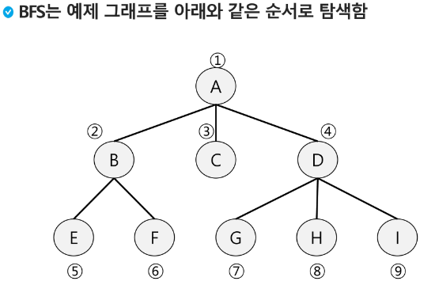
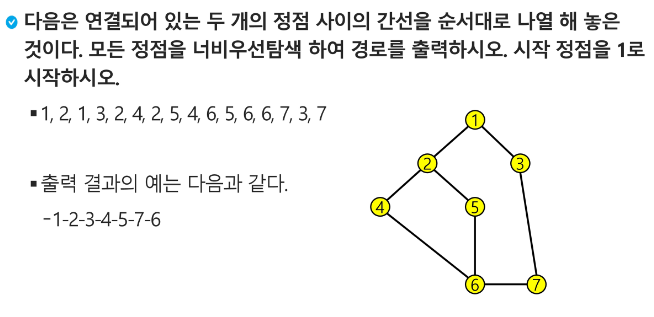

## 우선순위 큐

- 특성
    - 우선순위를 가진 항목들을 저장하는 큐
    - FIFO 순서가 아니라 우선순위가 높은 순서대로 먼저 나가게 됨
- 적용분야
    - 시뮬레이션 시스템
    - 네트워크 트래픽 제어
    - 운영체제의 테스크 스케줄링
- 구현
    - 배열 → 삽입이나 삭제 연산 시 원소의 재배치 발생, 시간 및 메모리 낭비 문제
    - 리스트

</br>

## 버퍼

- 데이터를 한 곳에서 다른 한 곳으로 전송하는 동안 일시적으로 그 데이터를 보관하는 메모리의 영역
- 버퍼링: 버퍼를 활용하는 방식 또는 버퍼를 채우는 동작을 의미
- 버퍼의 자료구조
    - 버퍼는 일반적으로 입출력 및 네트워크와 관련된 기능에서 이용됨
    - 순서대로 입출력, 전달되어야 하므로 FIFO 방식의 자료구조인 큐 활용

</br>

## BFS

- 그래프를 탐색하는 방법에는 크게 두 가지가 있음
    - 깊이 우선 탐색(Depth First Search, DFS)
    - 너비 우선 탐색(Breadth First Search, BFS)
- 너비우선탐색은 탐색 시작점의 인접한 정점들을 먼저 모두 차례로 방문한 후에, 방문했던 정점을 시작점으로 하여 다시 인접한 정점들을 차례로 방문하는 방식
- 인접한 정점들에 대해 탐색을 한 후, 차례로 다시 너비우선탐색을 진행해야 하므로, 선입선출 형태의 자료구조인 큐를 활용
    
    
    
- 코드(매우 중요, 암기!!)
    
    ```python
    def BFS(G, v): # 그래프 G, 탐색 시작점 v
        visited = [0]*(n+1) # n: 정점의 개수
        queue = []
        queue.append(v) # 시작점 v를 큐에 삽입
        visited[v] = 1 # 시작점이 인큐되었음을 표시
        while queue: # 큐가 비어있지 않은 경우
            t = queue.pop(0) # 큐의 첫번째 원소 반환
            visit(t) # 정점 t에서 할 일
            for i in G[t]: # t와 연결된 모든 정점에 대해(인접리스트인 경우)
                if not visited[i]: # 방문되지 않은 곳이라면
                    queue.append(i) # 큐에 넣기
                    visited[i] = visited[n] + 1 # n으로부터 1만큼 이동 
    								# 최단거리, 최소시간 구할 때 사용
    								# BFS에서는 출발점이 여러개일 수 있음(큐에 남아있으면 꺼내면 됨)
    ```
    
- 예제
    - 초기상태
        - Visited 배열 초기화
        - Q 생성
        - 시작점 enqueue
    - A점부터 시작
        - dequeue A
        - A 방문한 것으로 표시
        - A의 인접점 enqueue
    - 탐색 진행(B → C → D → E → F → …)
        - dequeue B
        - B 방문한 것으로 표시
        
        ```
        
        def BFS(G, v): # 그래프 G, 탐색 시작점 v
            visited = [0]*(n+1) # n: 정점의 개수
            queue = []
            queue.append(v) # 시작점 v를 큐에 삽입
            visited[v] = 1 # 시작점이 인큐되었음을 표시
            while queue: # 큐가 비어있지 않은 경우
                t = queue.pop(0) # 큐의 첫번째 원소 반환
                visit(t) # 정점 t에서 할 일
                for i in G[t]: # t와 연결된 모든 정점에 대해(인접리스트인 경우)
                    if not visited[i]: # 방문되지 않은 곳이라면
                        queue.append(i) # 큐에 넣기
                        visited[i] = visited[n] + 1 # n으로부터 1만큼 이동
        ```
        
        - B의 인접점 enqueue
    - Q가 비었으므로 탐색 종료
- 실습예제



```python
'''
7 8
1 2 1 3 2 4 2 5 4 6 5 6 6 7 3 7
'''

def bfs(v, N):
    visited = [0]*(N+1) # visited 생성
    q = [v] # 큐 생성 # 시작점 인큐
    visited[v] = 1 # 시작점 인큐표시
    while q: # 큐가 비어있지 않으면
        t = q.pop(0) # 디큐
        print(t, end=' ') # t에서 처리할 일
        for v in adjL[t]: # t에 인접이고 방문한 적 없는 v
            if visited[v] == 0:
                q.append(v) # v 인큐
                visited[v] = visited[t] + 1 # v 인큐표시
    print(visited)

V, E = map(int, input().split())
arr = list(map(int, input().split()))
adjL = [[] for _ in range(V+1)]
for i in range(E):
    n1, n2 = arr[i*2], arr[i*2+1]
    adjL[n1].append(n2)
    adjL[n2].append(n1)

bfs(1, V) # 1 2 3 4 5 7 6 [0, 1, 2, 2, 3, 3, 4, 3]
```

</br>

## 미로 찾기 힌트

- bfs(i,j,N) 형태로 x좌표, y좌표 기록
- visited를 2차원 배열로 만들거나(미로와 똑같은 형태), 지나온 길을 벽(1)으로 메꾸는 방법