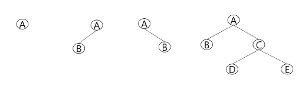

- 기존에 배웠던 알고리즘들 빠르고 정확하게 푸는 연습을 하자!

</br>

## 트리

- 트리란?
    - 비선형구조
    - 원소들 간 1:n 관계를 가지는 자료구조
    - 원소들 간 계층관계를 가지는 계층형 자료구조
    - 상위 원소에서 하위 원소로 내려가면서 확장되는 트리 모양의 구조

- 정의
    - 한 개 이상의 노드로 이루어진 유한 집합이며 다음 조건을 만족
        - 노드 중 최상위 노드를 루트(root)라 함
        - 나머지 노드들은 n(≥0)개의 분리집합으로 T1, …, TN으로 분리될 수 있음
    - 이들 T1, …, TN은 각각 하나의 트리가 되며(재귀적 정의) 루트의 부 트리(subtree)라 한다.
        
        
        
    - 차수(degree)
        - 노드의 차수: 노드에 연결된 자식 노드의 수
        - 트리의 차수: 트리에 있는 노드에 차수 중에서 가장 큰 값
        - 단말 노드(리프 노드): 차수가 0인 노드, 자식 노드가 없는 노드
    - 높이
        - 노드의 높이: 루트에서 노드에 이르는 간선의 수. 노드의 레벨. (0부터 시작할 수도, 1부터 시작할 수도 있음)
        - 트리의 높이: 트리에 있는 노드의 높이 중에서 가장 큰 값.

</br>

## 이진 트리

- 이진 트리란?
    - 모든 노드들이 2개의 서브트리를 갖는 특별한 형태의 트리
    - 각 노드가 자식 노드를 **최대한 2개**까지만 가질 수 있는 트리
        
        
        

- 특성
    - 레벨 i에서의 노드의 최대 개수는 `2^i`개 (i=0부터 시작)
    - 높이가 h인 이진트리가 가질 수 있는 노드의 최소 개수는 `(h+1)`개가 되며, 최대 개수는 `(2^(h+1)-1)`개가 됨.
        - 자식 노드가 한 개씩만 연결된 경우(최소)
        - 자식 노드가 2개씩 연결된 경우(최대)

- 종류
    - 포화 이진 트리(Full Binary Tree)
        - 모든 레벨에 노드가 포화상태로 차 있는 이진트리
        - 높이가 h일 때, 최대의 노드 개수인 `(2^(h+1)-1)`개의 노드를 가진 이진 트리
        - 루트를 1번으로 하여 `(2^(h+1)-1)`까지 정해진 위치에 대한 노드 번호를 가짐
            
            
            
    
    - 완전 이진 트리(Complete Binary Tree)
        - 높이가 h이고 노드 수가 n개일 때(단, `2^h` ≤ n <`(2^(h+1)-1)`) , 포화 이진 트리의 노드번호 1번부터 n번까지 빈 자리가 없는 이진트리
        - 포화 이진트리와 비교해볼 때 빠지긴 빠졌지만 중간에 빠진 번호는 없는 트리
            
            
            
    
    - 편향 이진 트리(Skewed Binary Tree)
        - 높이 h에 대한 최소 개수의 노드를 가지면서 한쪽 방향의 자식 노드만을 가진 이진 트리
        - 선형관계이므로, 바람직한 트리 모양은 아님
            
            
            

- 순회
    - 순회(traversal)란 트리의 각 노드를 중복되지 않게 전부 방문(visit)하는 것을 말하는데 트리는 비선형 구조이기 때문에 선형구조에서와 같이 선후 연결관계를 알 수 없다.
    - 순회방법
        
        
        
        - 전위순회(preorder traversal): VLR
            - 부모노드 방문 후, 자식노드를 좌우 순서로 방문 → 부모노드를 `처음` 방문
                
                
                
        - 중위순회(inorder traversal): LVR
            - 왼쪽 자식노드, 부모노드, 오른쪽 자식노드 순으로 방문 → 부모노드를 `중간에` 방문
                
                
                
        - 후위순회(postorder traversal): LRV
            - 자식노드를 좌우 순서로 방문한 후, 부모노드 방문 → 부모노드를 `마지막에` 방문
                
                
                

- 배열을 이용한 이진트리의 표현
    - 레벨 n에 있는 노드에 대하여 좌우 순으로 2^n 부터 2^(n+1)-1까지 번호를 차례로 부여하고. 노드 번호를 배열의 인덱스로 사용
        
        
        
    - 노드 번호의 성질
        - 노드 번호가 i인 노드의 …
            - 부모 노드 번호: `i/2`
            - 왼쪽 자식 노드 번호: `2*i`
            - 오른쪽 자식 노드 번호: `2*i+1`
            - 레벨 n의 노드의 시작 번호: `2^n`
    - 이진트리의 저장
        - 부모 번호를 인덱스로 자식 번호를 저장 - 순회 시 용이(정점끼리의 연결관계만을 트리로 표현하되, 내용물은 별도의 배열에 저장)
            
            
            
        - 자식 번호를 인덱스로 부모 번호를 저장 - 루트, 조상 찾기 시 용이
            
            
            
            
            
    - 배열을 이용한 이진트리의 표현의 단점
        - 편향 이진 트리의 경우 사용하지 않는 배열 원소에 대한 메모리 공간 낭비 발생
        - 트리의 중간에 새로운 노드를 삽입하거나 기존의 노드를 삭제할 경우 배열의 크기 변경 어려워 비효율적

```